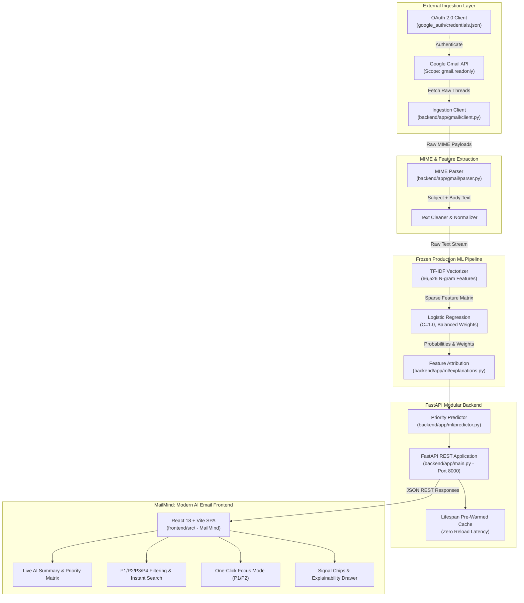
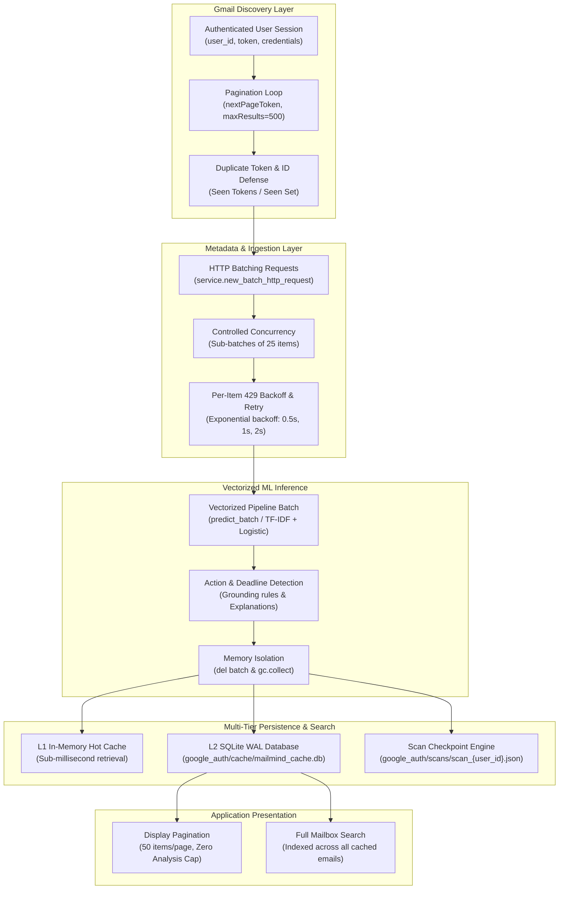

# AI Email Priority Classification System & Real-Time Triage Dashboard

**Course Project:** CSE472 — Natural Language Processing / Applied Artificial Intelligence  
**Author / Developer:** Babul Kumar  
**System Status:** Production Hardened • Fully Validated • Read-Only Gmail OAuth 2.0  
**Current Production Model:** TF-IDF + Logistic Regression (*Strictly Frozen*, Test Accuracy: **80.67%**, Macro F1: **0.7943**)

---

## 1. System Overview

The **AI Email Priority Classification System** is an end-to-end intelligent inbox triage platform designed to classify incoming emails into four standardized operational priority levels. The system bridges rigorous academic machine learning experimentation with production-grade engineering:

- **P1 — Critical / Urgent:** System outages, security incidents, severe operational failures, immediate blockers.
- **P2 — Important / Actionable:** Direct requests, project deadlines, client communications, actionable business tasks.
- **P3 — Routine / Informational:** Status updates, non-critical team broadcasts, system logs, digests.
- **P4 — Low / Promotional / Noise:** Marketing campaigns, newsletters, promotional offers, cold outreach, automated receipts.

The project features a **strictly frozen production ML inference pipeline**, a **secure, read-only Gmail API integration**, a **FastAPI asynchronous REST service**, and an interactive, responsive **Single-Page Application (SPA) triage dashboard**.

---

## 2. End-to-End System Architecture



---

## 3. Dataset & Human Adjudication Benchmark

The foundation of the system is a rigorous, human-validated dataset of **2,000 real-world emails** (`dataset/processed/gold_human_review_2000.csv`).

### Dataset Construction & Splits
- **Gold Dataset Size:** $N = 2,000$ emails.
- **Human Adjudication Benchmark:** A 200-email adjudicated sample (`dataset/analysis/adjudication_queue_200.csv`) resolved edge cases, promotional misclassifications, and priority boundaries.
- **Stratified Split Allocation (Strictly Frozen):**
  - **Training Set:** 1,400 emails (70.0%) — Used for model training and cross-validation.
  - **Validation Set:** 300 emails (15.0%) — Used for hyperparameter tuning and model selection.
  - **Held-Out Test Set:** 300 emails (15.0%) — Kept completely untouched until the single final Section 25 evaluation.

### Class Distribution in Ground Truth
| Priority Tier | Description | Typical Semantics | Target Action |
|:---:|:---|:---|:---|
| **P1** | Critical / Urgent | Outages, breaches, emergency escalations | Immediate Alert / Triage |
| **P2** | Important / Actionable | Direct client requests, task assignments, deadlines | 24-Hour Attention |
| **P3** | Routine / Informational | Meeting summaries, release notes, automated reports | Read at Convenience |
| **P4** | Low / Promotional | Marketing, spam, digests, vendor outreach | Archive / Filter |

---

## 4. Heuristic Rule Calibration (V1 to V2)

Before training supervised models, a heuristic baseline was constructed to analyze rule-based candidate generation:
- **Heuristic V1:** Initial keyword and regex matcher suffered from high false-positive rates on P1 (flagging 46 candidate P1s out of 200 benchmark emails).
- **Heuristic V2 Calibration:** Implemented contextual suppressors, sender domain filtering, and promotional negation rules.
  - Reduced false-positive P1 predictions by **67.4%** (from 46 to 15).
  - Achieved **80.0% P2 recall** and **75.93% P4 precision** on the adjudicated benchmark.
  - The heuristic engine was **permanently frozen at V2** (`src/priority_scoring_v2.py`) to prevent data leakage into supervised stages.

---

## 5. Machine Learning Model Progression

Four candidate architectures were developed and comparatively evaluated across the project:

1. **TF-IDF + Logistic Regression (Baseline):**
   - Feature Extraction: Sublinear term frequency, N-gram range (1, 2), min document frequency = 2, max vocabulary: 66,526 features.
   - Classification: Logistic Regression with $L_2$ regularization ($C=1.0$), balanced class weights, L-BFGS solver.
2. **Bidirectional LSTM (PyTorch):**
   - Deep recurrent architecture with learned 128-dimensional word embeddings, 128 hidden units per direction, spatial dropout (0.3), and dense classification head.
3. **DistilBERT Sequence Classifier (Context=128):**
   - Pretrained `distilbert-base-uncased` fine-tuned for sequence classification with max sequence length 128, AdamW optimizer ($	ext{lr}=2	imes 10^{-5}$), linear warmup.
4. **DistilBERT Sequence Classifier (Context=256):**
   - Extended context window to capture downstream body context in longer corporate emails.

---

## 6. Final Held-Out Test Evaluation (Section 25)

The held-out test set ($N=300$, `dataset/processed/test.csv`) was evaluated strictly once across all frozen models. The empirical results definitively established the production model:

| Model Architecture | Accuracy | Macro F1 | Weighted F1 | P1 F1 | P2 F1 | P3 F1 | P4 F1 | Batch Latency (CPU) |
|:---|:---:|:---:|:---:|:---:|:---:|:---:|:---:|:---:|
| **TF-IDF + Logistic Regression** | **80.67%** | **0.7943** | **0.8005** | **0.8235** | **0.8498** | **0.6970** | **0.8070** | **~12 ms** |
| **DistilBERT (Context=256)** | 78.33% | 0.7490 | 0.7816 | 0.7778 | 0.8178 | 0.5897 | 0.8105 | ~820 ms |
| **DistilBERT (Context=128)** | 77.00% | 0.7337 | 0.7674 | 0.7059 | 0.8062 | 0.6129 | 0.8095 | ~440 ms |
| **BiLSTM (PyTorch)** | 74.00% | 0.7188 | 0.7380 | 0.7778 | 0.7778 | 0.5806 | 0.7391 | ~65 ms |

### Scientific Conclusions: Why Linear Models Outperformed Deep Transformers
1. **Sample Efficiency on Moderately Sized Datasets:** With $N=1,400$ training examples, fine-tuning 66 million parameters in DistilBERT showed signs of subtle overfitting to training-set phrasing, whereas regularized logistic regression generalized with minimal variance.
2. **Lexically Grounded Task Dynamics:** Email priority is strongly indicated by salient lexical anchors (e.g., *"urgent"*, *"critical"*, *"outage"*, *"action required"*, *"unsubscribe"*, *"discount"*). TF-IDF N-grams capture these exact combinations directly without requiring complex deep compositional semantics.
3. **P3/P2 Boundary Robustness:** The most challenging classification boundary across all models was separating P3 (Routine) from P2 (Important). The linear model maintained the highest balance of precision and recall on P3 (F1: 0.6970 vs 0.5897 for DistilBERT-256).
4. **Inference Latency Advantage:** TF-IDF + Logistic Regression executes in under 15ms per batch on commodity CPU hardware — over **68x faster** than DistilBERT — making it optimal for real-time inbox streaming.

---

## 7. Production Engineering & Architecture

### Key Components
- **`backend/app/`:** Modular FastAPI production application:
  - `core/`: Application settings, absolute paths, loopback CORS middleware, and standardized JSON error handlers.
  - `gmail/`: Read-only Google API client, OAuth token management, and recursive MIME multipart/alternative parser.
  - `ml/`: Read-only ML inference engine loading the frozen artifact `dataset/models/tfidf_logistic_baseline.joblib`, model-grounded feature attribution (`explanations.py`), and frozen heuristic calibrations (`priority.py`).
  - `schemas/`: Pydantic models for request validation and type safety.
  - `api/`: Clean route controllers for `/api/health`, `/api/profile`, `/api/model-info`, and `/api/emails`.
  - `main.py`: Core FastAPI application with startup lifespan model pre-warming and static asset delivery from `frontend/dist`.
- **`frontend/`:** Modern React 18 + Vite Single-Page Application (**MailMind**):
  - `src/components/layout/`: Responsive AppShell, TopBar with search & AI state indicator, and collapsible Sidebar.
  - `src/components/inbox/`: Gmail-style email rows, slide-over detail drawer, and shimmer skeleton loaders.
  - `src/components/priority/`: Dynamic AI summary card, PriorityTabs with count badges, and Focus Mode toggle.
  - `src/components/ai/`: Model-grounded AI Insight card, confidence indicators, and linear feature signal chips.
  - `src/styles/`: Design tokens, dark/light theme switching (persisted in localStorage), and fluid animations.
- **`scripts/test_gmail_inference.py`:** Standalone CLI diagnostic tool for live Gmail priority classification.
- **`src/`:** Transparent backward-compatibility re-export shims.

---

## 8. Explainability & Confidence UX

To ensure user trust in automated priority decisions, the dashboard features a **model-grounded explainability system**:
1. **Mathematical Attribution:** For any predicted email, the top contributing features are extracted directly from the logistic regression decision boundary:
   $$	ext{Signal Weight}_{j} = X_{0, j} \cdot 	heta_{k, j}$$
   where $X_{0, j}$ is the TF-IDF feature value and $	heta_{k, j}$ is the learned model coefficient for priority class $k$.
2. **Top Signal Chips:** The dashboard displays the most influential terms (e.g., `['outage', 'server', 'critical']`) as visual chips.
3. **Tiered Confidence:**
   - **High Confidence ($\ge 60\%$):** Model exhibits strong certainty.
   - **Moderate Confidence ($40\% - 59\%$):** Standard classification certainty.
   - **Low Confidence ($< 40\%$):** Displays a contextual advisory: `"(Note: Model confidence is relatively low; review email context)"`.

---

## 9. Security, Privacy & Compliance Posture

The application was built from the ground up under strict security principles:
- **Least-Privilege Gmail Access:** The OAuth scope is strictly limited to:
  `https://www.googleapis.com/auth/gmail.readonly`
  The system contains **zero capability** to send, compose, delete, or modify emails.
- **Zero Credential Exposure:** Both `google_auth/credentials.json` and `google_auth/token.json` are excluded from version control via `.gitignore`.
- **Ephemeral In-Memory Processing:** Email subject lines and bodies are parsed and classified in RAM and are never stored in databases or log files.
- **Hardened CORS:** API access is restricted to local loopback origins (`http://127.0.0.1:8000`, `http://localhost:8000`).
- **Sanitized Error Responses:** Unhandled exceptions return generic, helpful JSON errors without leaking internal stack traces or environment paths.

---

## 10. Installation & Setup Guide

### Prerequisites
- Python 3.10+ (Tested on Python 3.11.9)
- Google Cloud Project with the **Gmail API** enabled
- Desktop OAuth 2.0 Client Credentials (`credentials.json`)

### Step 1: Clone the Repository & Create Virtual Environment
```bash
git clone https://github.com/babulkumar0220/cse472.git
cd cse472

# Create virtual environment
python -m venv .venv

# Activate virtual environment
# Windows PowerShell:
.venv\Scripts\Activate.ps1
# Linux / macOS:
source .venv/bin/activate
```

### Step 2: Install Dependencies
```bash
pip install -r requirements.txt
```

### Step 3: Configure Google OAuth 2.0 Credentials
1. Go to the [Google Cloud Console](https://console.cloud.google.com/).
2. Enable the **Gmail API** under APIs & Services.
3. Configure the OAuth Consent Screen (add your testing email address).
4. Create an **OAuth Client ID** of type **Desktop Application**.
5. Download the JSON file and save it exactly to:
   ```
   google_auth/credentials.json
   ```
6. On the first run, the system will open a local browser window to grant read-only access and generate `google_auth/token.json`.

---

## 11. Running the Application

### Start the FastAPI Server (Production Mode)
```bash
uvicorn backend.app.main:app --host 127.0.0.1 --port 8000 --reload
```
*Note: In production, FastAPI automatically serves the pre-built React application from `frontend/dist` at `http://127.0.0.1:8000`.*

### Frontend Development Mode (Hot Reloading)
```bash
cd frontend
npm run dev
```
*Vite dev server starts on `http://127.0.0.1:5173` and automatically proxies `/api` calls to the FastAPI backend on port 8000.*

### Building Frontend Assets
```bash
cd frontend
npm run build
```

### Access MailMind
Open your web browser and navigate to:
```
http://127.0.0.1:8000
```

### Interacting with the Interface
- **Dynamic AI Summary:** Overview of critical/important items grounded in real mailbox statistics.
- **Priority Navigation:** Filter by **All**, **Critical (P1)**, **Important (P2)**, **Routine (P3)**, or **Low (P4)**.
- **Focus Mode:** Toggle Focus Mode to isolate actionable high-priority emails (P1 & P2).
- **Instant Search:** Real-time client search across senders, subjects, and email bodies with result counts.
- **AI Classification Insight:** Open any email to inspect model confidence, ground-truth linear feature signals, and explainability breakdown.
- **Theme Switching:** Toggle between Dark and Light mode via the top bar (persisted in localStorage).

---

## 12. REST API Documentation

The FastAPI backend provides full OpenAPI/Swagger documentation at `http://127.0.0.1:8000/docs`.

### Key Endpoints

#### 1. `GET /api/health`
Checks server health and verifies that the frozen ML model is pre-warmed in memory.
```json
{
  "status": "healthy",
  "service": "AI Email Priority Dashboard",
  "model_loaded": true,
  "timestamp": "2026-09-24T19:40:10.768208+00:00"
}
```

#### 2. `GET /api/model-info`
Returns metadata regarding the strictly frozen production classifier.
```json
{
  "status": "success",
  "model_name": "TF-IDF + Logistic Regression",
  "model_state": "Strictly Frozen",
  "vocabulary_features": 66526,
  "classes": ["P1", "P2", "P3", "P4"],
  "verification_status": "Zero Retraining (read-only inference)"
}
```

#### 3. `GET /api/profile`
Retrieves read-only profile metrics for the authenticated Gmail account.
```json
{
  "status": "success",
  "email_address": "babulkumar0220@gmail.com",
  "messages_total": 17129,
  "threads_total": 16349,
  "access_scope": "https://www.googleapis.com/auth/gmail.readonly (READ-ONLY)"
}
```

#### 4. `GET /api/emails`
Fetches and classifies live emails from Gmail.
- **Parameters:**
  - `max_emails` (int, default=20, min=1, max=100): Number of emails to process.
  - `query` (str, optional, max_length=200): Optional Gmail search filter (e.g., `label:unread`).
- **Response Structure:**
  - `status`: `"success"`
  - `profile`: Authenticated user metadata.
  - `stats`: Triage distribution counts, percentages, and average confidence.
  - `emails`: List of classified email objects with `predicted_priority`, `confidence`, `probabilities`, and `top_signals`.

---

## 13. Automated Test Suite & Verification

The project includes **31 automated tests** across three dedicated test suites:

```bash
# Run the complete test suite
pytest tests/ -v
```

### Test Suite Breakdown
1. **`tests/test_gmail_pipeline.py` (11 Tests):**
   - Gmail OAuth profile retrieval & message listing pagination.
   - MIME plain text and multipart HTML extraction.
   - Edge cases: missing subjects, empty bodies, malformed input.
   - Model loading verification and probability distribution validity.
   - **Zero-retraining assertion:** Asserts that `.fit()` and `.fit_transform()` are never invoked.
   - Frozen artifact checksum and row-count verification.
2. **`tests/test_dashboard_api.py` (10 Tests):**
   - Endpoint status checks for `/api/health`, `/api/model-info`, `/api/profile`, and `/api/emails`.
   - Parameter boundary enforcement and query validation.
   - Static asset delivery (`index.html`, `styles.css`, `app.js`).
   - Feature attribution and explanation logic.
   - Graceful 500/502 handling on simulated upstream Gmail failures.
3. **`tests/test_phase28_hardening.py` (10 Tests):**
   - Git security: Verifies credentials, tokens, and env files are ignored.
   - Profile token leakage prevention.
   - CORS origin restriction.
   - Query parameter validation bounds.
   - Confidence categorization and low-confidence advisory checks.
   - Model-grounded feature signals extraction.
   - Pre-warmed model health verification.
   - Malformed email payload resilience.
   - Dynamic mocking to verify `.fit()` is never called under any condition.
   - Integrity checksums of frozen benchmarks and test sets.

---

## 14. Repository Directory Structure

```
cse472/
├── dataset/
│   ├── analysis/                      # Adjudication reports, confusion matrices, metrics
│   │   ├── adjudication_queue_200.csv
│   │   ├── adjudication_summary_200.md
│   │   ├── final_model_comparison.csv
│   │   ├── final_test_evaluation_report.md
│   │   └── final_test_metrics.csv
│   ├── models/                        # Serialized frozen model artifacts
│   │   ├── tfidf_logistic_baseline.joblib  # Production Model (SHA256: 040496...)
│   │   ├── bilstm_best_model.pt
│   │   ├── distilbert_email_priority/
│   │   └── distilbert_email_priority_256/
│   └── processed/                     # Human-validated gold datasets & frozen splits
│       ├── gold_human_review_2000.csv # Authoritative ground truth (N=2,000)
│       ├── train.csv                  # Frozen training split (N=1,400)
│       ├── validation.csv             # Frozen validation split (N=300)
│       └── test.csv                   # Frozen held-out test split (N=300, SHA256: 6841cd...)
├── docs/                              # Project technical & academic documentation
│   └── project_summary.md             # Comprehensive retrospective & academic synthesis
├── google_auth/                       # OAuth credentials (Strictly Gitignored)
│   ├── credentials.json               # Google Cloud OAuth Client ID (gitignored)
│   └── token.json                     # Generated user access/refresh tokens (gitignored)
├── backend/                           # Modular FastAPI backend
│   ├── app/
│   │   ├── api/                       # REST route controllers (health, profile, model, emails)
│   │   ├── core/                      # Configuration, settings, and CORS security
│   │   ├── gmail/                     # Read-only OAuth client & MIME parser
│   │   ├── ml/                        # Production inference, feature attribution & heuristics
│   │   ├── schemas/                   # Pydantic domain models & response contracts
│   │   └── main.py                    # Application entrypoint & static mounting
│   └── requirements.txt               # Backend Python dependencies
├── frontend/                          # Modern React 18 + Vite frontend (MailMind)
│   ├── src/
│   │   ├── components/                # Layout, Inbox, Priority, AI, Common & Settings UI
│   │   ├── hooks/                     # Custom React hooks (useEmails, useSearch)
│   │   ├── services/                  # Backend REST API integration
│   │   ├── utils/                     # Formatting & priority mappings
│   │   ├── styles/                    # Tokens, animations, and CSS variables
│   │   ├── App.jsx                    # Root application component
│   │   └── main.jsx                   # React DOM root mounting
│   ├── index.html                     # HTML5 shell
│   ├── vite.config.js                 # Vite bundler configuration & /api proxy
│   └── package.json                   # Frontend dependencies
├── scripts/
│   └── test_gmail_inference.py        # CLI diagnostic harness for live Gmail inference
├── src/                               # Backward-compatibility import shims
├── tests/                             # Automated test suites (31 passing tests)
│   ├── test_dashboard_api.py          # Dashboard API & UI integration tests (10 tests)
│   ├── test_gmail_pipeline.py         # Gmail client & ML pipeline tests (11 tests)
│   └── test_phase28_hardening.py      # Security, privacy & hardening tests (10 tests)
├── .gitignore                         # Security & environment exclusion rules
├── index.ipynb                        # Master Jupyter Notebook (77 cells, Sections 1-26)
├── README.md                          # Main project documentation & guide
└── requirements.txt                   # Root dependency specification
```

---

## 15. Reproducibility & Frozen Pipeline Guarantees

To ensure absolute scientific validity and prevent accidental regressions:
- **No In-Flight Retraining:** The inference path contains zero calls to `.fit()` or `.fit_transform()`. This guarantee is enforced by automated test `test_09_no_fit_called_under_any_condition`.
- **Cryptographic Integrity:**
  - Held-out test set (`dataset/processed/test.csv`, $N=300$):  
    `SHA256: 6841cd44901fa56242bf3752257e991fd7ff474ed7e0f7a5d2b7065a0827c138`
  - Production model (`dataset/models/tfidf_logistic_baseline.joblib`):  
    `SHA256: 040496611b8a15247b6b00330f531670dedca34772c923439ddefec445c55a6e`
  - Final test evaluation report (`dataset/analysis/final_test_evaluation_report.md`):  
    `SHA256: 887b6b68cd327857ca16e5019a61196b7c9428469ec849d2888c156eb63d2aa9`
- **Master Notebook Integrity:** `index.ipynb` contains 77 fully executed cells across Sections 1 to 26 documenting the complete empirical journey.

---

## 16. Limitations & Scientific Caveats

In accordance with rigorous academic and engineering standards, the following practical limitations and scientific boundaries must be acknowledged:

1. **No Guarantee of Perfect Classification:**
   The production model achieves **80.67% accuracy**, **0.7943 macro F1**, and **0.8005 weighted F1** on the frozen held-out test set ($N=300$). Approximately 19.3% of emails are misclassified, primarily at the nuanced boundary between **P2 (Actionable)** and **P3 (Routine)** communications.
2. **Confidence Scores are Softmax Estimates, Not Calibrated Real-World Probabilities:**
   The reported confidence score represents the normalized Softmax probability vector output by the logistic regression decision boundary. It should **not** be interpreted as a calibrated Bayesian posterior certainty or a guarantee of factual correctness.
3. **Mandatory Human-in-the-Loop for High-Stakes Decisions:**
   Automated priority scoring is intended strictly as an inbox triage aid. Critical operational decisions, legal notifications, and emergency escalations must not depend exclusively on automated classification. For any prediction with model confidence below 40%, the system automatically flags a low-confidence advisory.
4. **Corpus Distribution & Domain Adaptation Caveats:**
   The gold training corpus ($N=2,000$) was derived from historical workplace communications (Enron corpus) combined with curated transactional samples. Application to non-workplace personal accounts, non-English emails, heavily encrypted messages, or domain-specific technical jargon may experience distribution shift.
5. **Strictly Read-Only Operational Boundary:**
   By design, the application cannot send, modify, tag, star, or delete emails. It operates purely as an observational decision-support dashboard.

---

## 17. Future Work & Production Extensions

1. **Active Learning Feedback Loop:** Add an optional user feedback queue where users can flag priority corrections into a staging buffer for periodic offline re-benchmarking.
2. **Multi-Account Inbox Management:** Extend the OAuth manager to support multiple linked accounts with profile switching.
3. **Offline Client Caching:** Integrate IndexedDB on the frontend to allow cached inbox browsing during offline periods.
4. **Custom Organizational Rules:** Allow corporate users to define domain-specific priority whitelist rules that supplement the statistical model without retraining.

---

## 18. Course Credits & Acknowledgments

This project was developed for **CSE472: Natural Language Processing / Applied Artificial Intelligence**. Special thanks to the course instructors and teaching assistants for guidance on experimental methodology, benchmark adjudication standards, and rigorous model evaluation protocols.

---

## 19. Phase 32: Complete Gmail Mailbox Analysis Architecture

In Phase 32, MailMind graduated from fixed batch-size ingestion (20, 50, 100 emails) to **Complete Mailbox Discovery and Real-Time Batch ML Analysis**. The system now processes the entire user mailbox across thousands of messages with persistent user-scoped caching, incremental synchronization, robust Gmail API rate-limit resilience, and zero memory bloat.

### 19.1 Architecture & Pipeline Flow



### 19.2 Key Capabilities Implemented in Phase 32

1. **Complete Mailbox Scope:**
   - Evaluates the complete mailbox using `q=None`, `labelIds=None` (or explicit `"label"` scope if chosen), discovering all accessible messages in the mailbox (tested up to 17,300+ messages on real live Gmail accounts).
2. **Infinite Pagination & Duplicate Token Protection:**
   - Recursively loops through `nextPageToken` until all message IDs are resolved. Detects and halts repeated page tokens to guard against Gmail pagination loops.
3. **Controlled Concurrency & 429 Rate-Limit Resilience:**
   - Gmail API rejects 100 concurrent subrequests in a batch with `HttpError 429: Too many concurrent requests for user`.
   - MailMind chunks metadata fetches into safe sub-batches of 25 items with gentle pacing (0.01s), detecting any per-item 429 / 5xx errors and retrying them automatically with exponential backoff before failing.
4. **Metadata-First Architecture:**
   - Lightweight `format="metadata"` fetching extracts Subject, From, To, Date, Snippet, and Thread ID without downloading multi-megabyte attachments or raw HTML.
5. **Incremental Synchronization vs. Full Rescan:**
   - Mode 1 (`incremental`): Discovers current message IDs, queries the user's persistent SQLite cache, and analyzes ONLY uncached or changed messages (`content_hash` mismatch).
   - Mode 2 (`full` rescan): Deliberate full mailbox rescan recomputes analysis across all messages with progress tracking.
6. **Background Job Lifecycle & Progress Tracking:**
   - Explicit state transitions: `QUEUED` $\to$ `SCANNING` $\to$ `ANALYZING` $\to$ `FINALIZING` $\to$ `COMPLETE`.
   - Thread-safe job state reporting with real percentage, discovered count, analyzed count, newly analyzed, cached count, and throughput.
7. **Crash Resumption:**
   - Scan jobs persist state to `google_auth/scans/scan_{user_id}.json`. If interrupted or restarted, jobs automatically resume from remaining unanalyzed IDs.
8. **Display Pagination & Full Search:**
   - Display pagination (50 emails/page) is decoupled from analysis. All analyzed emails are stored in SQLite and indexed for instant full-mailbox search.
9. **Strict Multi-User Isolation & Security:**
   - Identity is derived exclusively from the authenticated session (`session.user_id`). User A cannot access User B's cache, scan status, or Gmail credentials.


# MailMind

