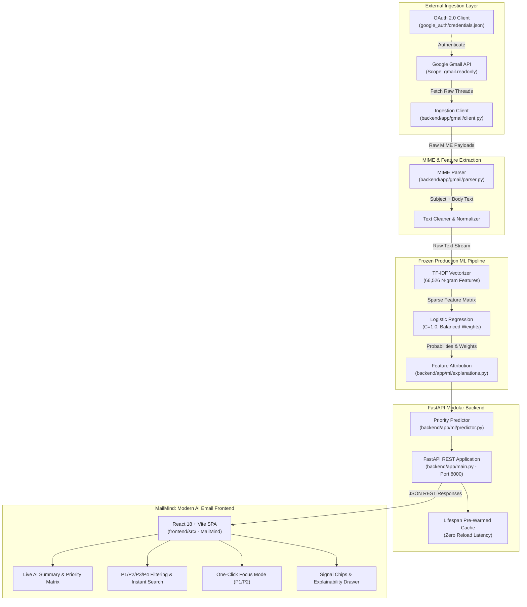
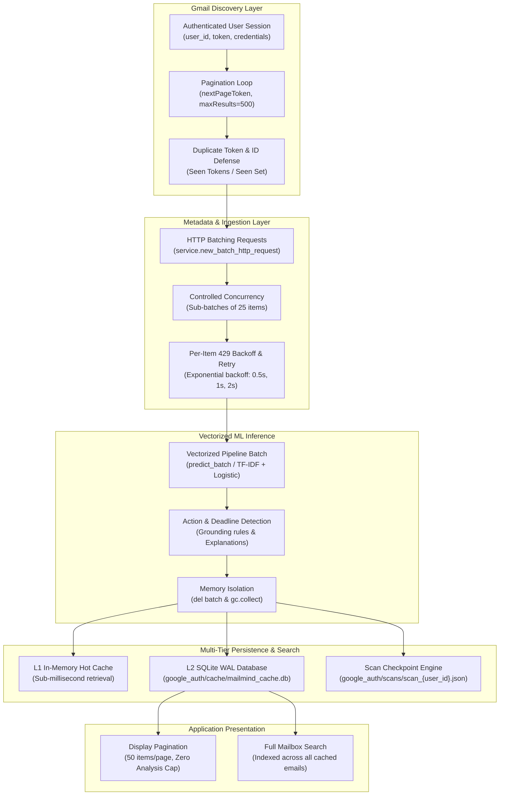

# AI Email Priority Classification System & Real-Time Triage Dashboard

**Course Project:** CSE472 — Natural Language Processing / Applied Artificial Intelligence  
**Author / Developer:** Babul Kumar  
**System Status:** Production Hardened • Fully Validated • Read-Only Gmail OAuth 2.0  
**Current Production Model:** `priority-v5.1` (Active Production Model • SHA-256: `8524ad73965859ee022f1271caee0040928e7805ab7d32c49b2f26e994f98c06`)  
**Previous Production Model:** `priority-v4.1` (Rollback Model • SHA-256: `09fe269f19ad6afb38e71b56f8c6ee7a386e59605c62c892478400bc09d5cbd0`)  
**Model Lifecycle & Validation:** `priority-v5.1` completed dataset remediation, offline evaluation, shadow evaluation (17,329 real mailbox messages, 0 P1 downgrades), controlled canary evaluation (13/13 safety gates passed), and explicit atomic production promotion. Performance remains high across operational boundaries while preserving 100% safety-critical authentication retention without claiming perfection; `priority-v4.1` is retained as an instantaneous rollback model.

---

## 1. System Overview

The **AI Email Priority Classification System** is an end-to-end intelligent inbox triage platform designed to classify incoming emails into four standardized operational priority levels. The system bridges rigorous academic machine learning experimentation with production-grade engineering:

- **P1 — Critical / Urgent:** System outages, security incidents, severe operational failures, immediate blockers.
- **P2 — Important / Actionable:** Direct requests, project deadlines, client communications, actionable business tasks.
- **P3 — Routine / Informational:** Status updates, non-critical team broadcasts, system logs, digests.
- **P4 — Low / Promotional / Noise:** Marketing campaigns, newsletters, promotional offers, cold outreach, automated receipts.

The project features a **strictly frozen production ML inference pipeline**, a **secure, read-only Gmail API integration**, a **FastAPI asynchronous REST service**, and an interactive, responsive **Single-Page Application (SPA) triage dashboard**.

---

## 2. End-to-End System Architecture



---

## 3. Dataset & Human Adjudication Benchmark

The foundation of the system is a rigorous, human-validated dataset of **2,000 real-world emails** (`dataset/processed/gold_human_review_2000.csv`).

### Dataset Construction & Splits
- **Gold Dataset Size:** $N = 2,000$ emails.
- **Human Adjudication Benchmark:** A 200-email adjudicated sample (`dataset/analysis/adjudication_queue_200.csv`) resolved edge cases, promotional misclassifications, and priority boundaries.
- **Stratified Split Allocation (Strictly Frozen):**
  - **Training Set:** 1,400 emails (70.0%) — Used for model training and cross-validation.
  - **Validation Set:** 300 emails (15.0%) — Used for hyperparameter tuning and model selection.
  - **Held-Out Test Set:** 300 emails (15.0%) — Kept completely untouched until the single final Section 25 evaluation.

### Class Distribution in Ground Truth
| Priority Tier | Description | Typical Semantics | Target Action |
|:---:|:---|:---|:---|
| **P1** | Critical / Urgent | Outages, breaches, emergency escalations | Immediate Alert / Triage |
| **P2** | Important / Actionable | Direct client requests, task assignments, deadlines | 24-Hour Attention |
| **P3** | Routine / Informational | Meeting summaries, release notes, automated reports | Read at Convenience |
| **P4** | Low / Promotional | Marketing, spam, digests, vendor outreach | Archive / Filter |

---

## 4. Heuristic Rule Calibration (V1 to V2)

Before training supervised models, a heuristic baseline was constructed to analyze rule-based candidate generation:
- **Heuristic V1:** Initial keyword and regex matcher suffered from high false-positive rates on P1 (flagging 46 candidate P1s out of 200 benchmark emails).
- **Heuristic V2 Calibration:** Implemented contextual suppressors, sender domain filtering, and promotional negation rules.
  - Reduced false-positive P1 predictions by **67.4%** (from 46 to 15).
  - Achieved **80.0% P2 recall** and **75.93% P4 precision** on the adjudicated benchmark.
  - The heuristic engine was **permanently frozen at V2** (`src/priority_scoring_v2.py`) to prevent data leakage into supervised stages.

---

## 5. Machine Learning Model Progression

Four candidate architectures were developed and comparatively evaluated across the project:

1. **TF-IDF + Logistic Regression (Baseline):**
   - Feature Extraction: Sublinear term frequency, N-gram range (1, 2), min document frequency = 2, max vocabulary: 66,526 features.
   - Classification: Logistic Regression with $L_2$ regularization ($C=1.0$), balanced class weights, L-BFGS solver.
2. **Bidirectional LSTM (PyTorch):**
   - Deep recurrent architecture with learned 128-dimensional word embeddings, 128 hidden units per direction, spatial dropout (0.3), and dense classification head.
3. **DistilBERT Sequence Classifier (Context=128):**
   - Pretrained `distilbert-base-uncased` fine-tuned for sequence classification with max sequence length 128, AdamW optimizer ($	ext{lr}=2	imes 10^{-5}$), linear warmup.
4. **DistilBERT Sequence Classifier (Context=256):**
   - Extended context window to capture downstream body context in longer corporate emails.

---

## 6. Final Held-Out Test Evaluation (Section 25)

The held-out test set ($N=300$, `dataset/processed/test.csv`) was evaluated strictly once across all frozen models. The empirical results definitively established the production model:

| Model Architecture | Accuracy | Macro F1 | Weighted F1 | P1 F1 | P2 F1 | P3 F1 | P4 F1 | Batch Latency (CPU) |
|:---|:---:|:---:|:---:|:---:|:---:|:---:|:---:|:---:|
| **TF-IDF + Logistic Regression** | **80.67%** | **0.7943** | **0.8005** | **0.8235** | **0.8498** | **0.6970** | **0.8070** | **~12 ms** |
| **DistilBERT (Context=256)** | 78.33% | 0.7490 | 0.7816 | 0.7778 | 0.8178 | 0.5897 | 0.8105 | ~820 ms |
| **DistilBERT (Context=128)** | 77.00% | 0.7337 | 0.7674 | 0.7059 | 0.8062 | 0.6129 | 0.8095 | ~440 ms |
| **BiLSTM (PyTorch)** | 74.00% | 0.7188 | 0.7380 | 0.7778 | 0.7778 | 0.5806 | 0.7391 | ~65 ms |

### Scientific Conclusions: Why Linear Models Outperformed Deep Transformers
1. **Sample Efficiency on Moderately Sized Datasets:** With $N=1,400$ training examples, fine-tuning 66 million parameters in DistilBERT showed signs of subtle overfitting to training-set phrasing, whereas regularized logistic regression generalized with minimal variance.
2. **Lexically Grounded Task Dynamics:** Email priority is strongly indicated by salient lexical anchors (e.g., *"urgent"*, *"critical"*, *"outage"*, *"action required"*, *"unsubscribe"*, *"discount"*). TF-IDF N-grams capture these exact combinations directly without requiring complex deep compositional semantics.
3. **P3/P2 Boundary Robustness:** The most challenging classification boundary across all models was separating P3 (Routine) from P2 (Important). The linear model maintained the highest balance of precision and recall on P3 (F1: 0.6970 vs 0.5897 for DistilBERT-256).
4. **Inference Latency Advantage:** TF-IDF + Logistic Regression executes in under 15ms per batch on commodity CPU hardware — over **68x faster** than DistilBERT — making it optimal for real-time inbox streaming.

---

## 7. Production Engineering & Architecture

### Key Components
- **`backend/app/`:** Modular FastAPI production application:
  - `core/`: Application settings, absolute paths, loopback CORS middleware, and standardized JSON error handlers.
  - `gmail/`: Read-only Google API client, OAuth token management, and recursive MIME multipart/alternative parser.
  - `ml/`: Read-only ML inference engine loading the frozen artifact `dataset/models/tfidf_logistic_baseline.joblib`, model-grounded feature attribution (`explanations.py`), and frozen heuristic calibrations (`priority.py`).
  - `schemas/`: Pydantic models for request validation and type safety.
  - `api/`: Clean route controllers for `/api/health`, `/api/profile`, `/api/model-info`, and `/api/emails`.
  - `main.py`: Core FastAPI application with startup lifespan model pre-warming and static asset delivery from `frontend/dist`.
- **`frontend/`:** Modern React 18 + Vite Single-Page Application (**MailMind**):
  - `src/components/layout/`: Responsive AppShell, TopBar with search & AI state indicator, and collapsible Sidebar.
  - `src/components/inbox/`: Gmail-style email rows, slide-over detail drawer, and shimmer skeleton loaders.
  - `src/components/priority/`: Dynamic AI summary card, PriorityTabs with count badges, and Focus Mode toggle.
  - `src/components/ai/`: Model-grounded AI Insight card, confidence indicators, and linear feature signal chips.
  - `src/styles/`: Design tokens, dark/light theme switching (persisted in localStorage), and fluid animations.
- **`scripts/test_gmail_inference.py`:** Standalone CLI diagnostic tool for live Gmail priority classification.
- **`src/`:** Transparent backward-compatibility re-export shims.

---

## 8. Explainability & Confidence UX

To ensure user trust in automated priority decisions, the dashboard features a **model-grounded explainability system**:
1. **Mathematical Attribution:** For any predicted email, the top contributing features are extracted directly from the logistic regression decision boundary:
   $$	ext{Signal Weight}_{j} = X_{0, j} \cdot 	heta_{k, j}$$
   where $X_{0, j}$ is the TF-IDF feature value and $	heta_{k, j}$ is the learned model coefficient for priority class $k$.
2. **Top Signal Chips:** The dashboard displays the most influential terms (e.g., `['outage', 'server', 'critical']`) as visual chips.
3. **Tiered Confidence:**
   - **High Confidence ($\ge 60\%$):** Model exhibits strong certainty.
   - **Moderate Confidence ($40\% - 59\%$):** Standard classification certainty.
   - **Low Confidence ($< 40\%$):** Displays a contextual advisory: `"(Note: Model confidence is relatively low; review email context)"`.

---

## 9. Security, Privacy & Compliance Posture

The application was built from the ground up under strict security principles:
- **Least-Privilege Gmail Access:** The OAuth scope is strictly limited to:
  `https://www.googleapis.com/auth/gmail.readonly`
  The system contains **zero capability** to send, compose, delete, or modify emails.
- **Zero Credential Exposure:** Both `google_auth/credentials.json` and `google_auth/token.json` are excluded from version control via `.gitignore`.
- **Ephemeral In-Memory Processing:** Email subject lines and bodies are parsed and classified in RAM and are never stored in databases or log files.
- **Hardened CORS:** API access is restricted to local loopback origins (`http://127.0.0.1:8000`, `http://localhost:8000`).
- **Sanitized Error Responses:** Unhandled exceptions return generic, helpful JSON errors without leaking internal stack traces or environment paths.

---

## 10. Installation & Setup Guide

### Prerequisites
- Python 3.10+ (Tested on Python 3.11.9)
- Google Cloud Project with the **Gmail API** enabled
- Desktop OAuth 2.0 Client Credentials (`credentials.json`)

### Step 1: Clone the Repository & Create Virtual Environment
```bash
git clone https://github.com/babulkumar0220/cse472.git
cd cse472

# Create virtual environment
python -m venv .venv

# Activate virtual environment
# Windows PowerShell:
.venv\Scripts\Activate.ps1
# Linux / macOS:
source .venv/bin/activate
```

### Step 2: Install Dependencies
```bash
pip install -r requirements.txt
```

### Step 3: Configure Google OAuth 2.0 Credentials
1. Go to the [Google Cloud Console](https://console.cloud.google.com/).
2. Enable the **Gmail API** under APIs & Services.
3. Configure the OAuth Consent Screen (add your testing email address).
4. Create an **OAuth Client ID** of type **Desktop Application**.
5. Download the JSON file and save it exactly to:
   ```
   google_auth/credentials.json
   ```
6. On the first run, the system will open a local browser window to grant read-only access and generate `google_auth/token.json`.

---

## 11. Running the Application

### Start the FastAPI Server (Production Mode)
```bash
uvicorn backend.app.main:app --host 127.0.0.1 --port 8000 --reload
```
*Note: In production, FastAPI automatically serves the pre-built React application from `frontend/dist` at `http://127.0.0.1:8000`.*

### Frontend Development Mode (Hot Reloading)
```bash
cd frontend
npm run dev
```
*Vite dev server starts on `http://127.0.0.1:5173` and automatically proxies `/api` calls to the FastAPI backend on port 8000.*

### Building Frontend Assets
```bash
cd frontend
npm run build
```

### Access MailMind
Open your web browser and navigate to:
```
http://127.0.0.1:8000
```

### Interacting with the Interface
- **Dynamic AI Summary:** Overview of critical/important items grounded in real mailbox statistics.
- **Priority Navigation:** Filter by **All**, **Critical (P1)**, **Important (P2)**, **Routine (P3)**, or **Low (P4)**.
- **Focus Mode:** Toggle Focus Mode to isolate actionable high-priority emails (P1 & P2).
- **Instant Search:** Real-time client search across senders, subjects, and email bodies with result counts.
- **AI Classification Insight:** Open any email to inspect model confidence, ground-truth linear feature signals, and explainability breakdown.
- **Theme Switching:** Toggle between Dark and Light mode via the top bar (persisted in localStorage).

---

## 12. REST API Documentation

The FastAPI backend provides full OpenAPI/Swagger documentation at `http://127.0.0.1:8000/docs`.

### Key Endpoints

#### 1. `GET /api/health`
Checks server health and verifies that the frozen ML model is pre-warmed in memory.
```json
{
  "status": "healthy",
  "service": "AI Email Priority Dashboard",
  "model_loaded": true,
  "timestamp": "2026-09-24T19:40:10.768208+00:00"
}
```

#### 2. `GET /api/model-info`
Returns metadata regarding the strictly frozen production classifier.
```json
{
  "status": "success",
  "model_name": "TF-IDF + Logistic Regression",
  "model_state": "Strictly Frozen",
  "vocabulary_features": 66526,
  "classes": ["P1", "P2", "P3", "P4"],
  "verification_status": "Zero Retraining (read-only inference)"
}
```

#### 3. `GET /api/profile`
Retrieves read-only profile metrics for the authenticated Gmail account.
```json
{
  "status": "success",
  "email_address": "babulkumar0220@gmail.com",
  "messages_total": 17129,
  "threads_total": 16349,
  "access_scope": "https://www.googleapis.com/auth/gmail.readonly (READ-ONLY)"
}
```

#### 4. `GET /api/emails`
Fetches and classifies live emails from Gmail.
- **Parameters:**
  - `max_emails` (int, default=20, min=1, max=100): Number of emails to process.
  - `query` (str, optional, max_length=200): Optional Gmail search filter (e.g., `label:unread`).
- **Response Structure:**
  - `status`: `"success"`
  - `profile`: Authenticated user metadata.
  - `stats`: Triage distribution counts, percentages, and average confidence.
  - `emails`: List of classified email objects with `predicted_priority`, `confidence`, `probabilities`, and `top_signals`.

---

## 13. Automated Test Suite & Verification

The project includes **305 automated tests** across multiple test suites:

```bash
# Run the complete test suite
pytest tests/ -v
```

### Test Suite Breakdown
1. **`tests/test_gmail_pipeline.py` (11 Tests):**
   - Gmail OAuth profile retrieval & message listing pagination.
   - MIME plain text and multipart HTML extraction.
   - Edge cases: missing subjects, empty bodies, malformed input.
   - Model loading verification and probability distribution validity.
   - **Zero-retraining assertion:** Asserts that `.fit()` and `.fit_transform()` are never invoked.
   - Frozen artifact checksum and row-count verification.
2. **`tests/test_dashboard_api.py` (10 Tests):**
   - Endpoint status checks for `/api/health`, `/api/model-info`, `/api/profile`, and `/api/emails`.
   - Parameter boundary enforcement and query validation.
   - Static asset delivery (`index.html`, `styles.css`, `app.js`).
   - Feature attribution and explanation logic.
   - Graceful 500/502 handling on simulated upstream Gmail failures.
3. **`tests/test_phase28_hardening.py` (10 Tests):**
   - Git security: Verifies credentials, tokens, and env files are ignored.
   - Profile token leakage prevention.
   - CORS origin restriction.
   - Query parameter validation bounds.
   - Confidence categorization and low-confidence advisory checks.
   - Model-grounded feature signals extraction.
   - Pre-warmed model health verification.
   - Malformed email payload resilience.
   - Dynamic mocking to verify `.fit()` is never called under any condition.
   - Integrity checksums of frozen benchmarks and test sets.

---

## 14. Repository Directory Structure

```
cse472/
├── dataset/
│   ├── analysis/                      # Adjudication reports, confusion matrices, metrics
│   │   ├── adjudication_queue_200.csv
│   │   ├── adjudication_summary_200.md
│   │   ├── final_model_comparison.csv
│   │   ├── final_test_evaluation_report.md
│   │   └── final_test_metrics.csv
│   ├── models/                        # Serialized frozen model artifacts
│   │   ├── tfidf_logistic_baseline.joblib  # Production Model (SHA256: 040496...)
│   │   ├── bilstm_best_model.pt
│   │   ├── distilbert_email_priority/
│   │   └── distilbert_email_priority_256/
│   └── processed/                     # Human-validated gold datasets & frozen splits
│       ├── gold_human_review_2000.csv # Authoritative ground truth (N=2,000)
│       ├── train.csv                  # Frozen training split (N=1,400)
│       ├── validation.csv             # Frozen validation split (N=300)
│       └── test.csv                   # Frozen held-out test split (N=300, SHA256: 6841cd...)
├── docs/                              # Project technical & academic documentation
│   └── project_summary.md             # Comprehensive retrospective & academic synthesis
├── google_auth/                       # OAuth credentials (Strictly Gitignored)
│   ├── credentials.json               # Google Cloud OAuth Client ID (gitignored)
│   └── token.json                     # Generated user access/refresh tokens (gitignored)
├── backend/                           # Modular FastAPI backend
│   ├── app/
│   │   ├── api/                       # REST route controllers (health, profile, model, emails)
│   │   ├── core/                      # Configuration, settings, and CORS security
│   │   ├── gmail/                     # Read-only OAuth client & MIME parser
│   │   ├── ml/                        # Production inference, feature attribution & heuristics
│   │   ├── schemas/                   # Pydantic domain models & response contracts
│   │   └── main.py                    # Application entrypoint & static mounting
│   └── requirements.txt               # Backend Python dependencies
├── frontend/                          # Modern React 18 + Vite frontend (MailMind)
│   ├── src/
│   │   ├── components/                # Layout, Inbox, Priority, AI, Common & Settings UI
│   │   ├── hooks/                     # Custom React hooks (useEmails, useSearch)
│   │   ├── services/                  # Backend REST API integration
│   │   ├── utils/                     # Formatting & priority mappings
│   │   ├── styles/                    # Tokens, animations, and CSS variables
│   │   ├── App.jsx                    # Root application component
│   │   └── main.jsx                   # React DOM root mounting
│   ├── index.html                     # HTML5 shell
│   ├── vite.config.js                 # Vite bundler configuration & /api proxy
│   └── package.json                   # Frontend dependencies
├── scripts/
│   └── test_gmail_inference.py        # CLI diagnostic harness for live Gmail inference
├── src/                               # Backward-compatibility import shims
├── tests/                             # Automated test suites (31 passing tests)
│   ├── test_dashboard_api.py          # Dashboard API & UI integration tests (10 tests)
│   ├── test_gmail_pipeline.py         # Gmail client & ML pipeline tests (11 tests)
│   └── test_phase28_hardening.py      # Security, privacy & hardening tests (10 tests)
├── .gitignore                         # Security & environment exclusion rules
├── index.ipynb                        # Master Jupyter Notebook (77 cells, Sections 1-26)
├── README.md                          # Main project documentation & guide
└── requirements.txt                   # Root dependency specification
```

---

## 15. Reproducibility & Frozen Pipeline Guarantees

To ensure absolute scientific validity and prevent accidental regressions:
- **No In-Flight Retraining:** The inference path contains zero calls to `.fit()` or `.fit_transform()`. This guarantee is enforced by automated test `test_09_no_fit_called_under_any_condition`.
- **Cryptographic Integrity:**
  - Held-out test set (`dataset/processed/test.csv`, $N=300$):  
    `SHA256: 6841cd44901fa56242bf3752257e991fd7ff474ed7e0f7a5d2b7065a0827c138`
  - Production model (`dataset/models/tfidf_logistic_baseline.joblib`):  
    `SHA256: 040496611b8a15247b6b00330f531670dedca34772c923439ddefec445c55a6e`
  - Final test evaluation report (`dataset/analysis/final_test_evaluation_report.md`):  
    `SHA256: 887b6b68cd327857ca16e5019a61196b7c9428469ec849d2888c156eb63d2aa9`
- **Master Notebook Integrity:** `index.ipynb` contains 77 fully executed cells across Sections 1 to 26 documenting the complete empirical journey.

---

## 16. Limitations & Scientific Caveats

In accordance with rigorous academic and engineering standards, the following practical limitations and scientific boundaries must be acknowledged:

1. **No Guarantee of Perfect Classification:**
   The production model achieves **80.67% accuracy**, **0.7943 macro F1**, and **0.8005 weighted F1** on the frozen held-out test set ($N=300$). Approximately 19.3% of emails are misclassified, primarily at the nuanced boundary between **P2 (Actionable)** and **P3 (Routine)** communications.
2. **Confidence Scores are Softmax Estimates, Not Calibrated Real-World Probabilities:**
   The reported confidence score represents the normalized Softmax probability vector output by the logistic regression decision boundary. It should **not** be interpreted as a calibrated Bayesian posterior certainty or a guarantee of factual correctness.
3. **Mandatory Human-in-the-Loop for High-Stakes Decisions:**
   Automated priority scoring is intended strictly as an inbox triage aid. Critical operational decisions, legal notifications, and emergency escalations must not depend exclusively on automated classification. For any prediction with model confidence below 40%, the system automatically flags a low-confidence advisory.
4. **Corpus Distribution & Domain Adaptation Caveats:**
   The gold training corpus ($N=2,000$) was derived from historical workplace communications (Enron corpus) combined with curated transactional samples. Application to non-workplace personal accounts, non-English emails, heavily encrypted messages, or domain-specific technical jargon may experience distribution shift.
5. **Strictly Read-Only Operational Boundary:**
   By design, the application cannot send, modify, tag, star, or delete emails. It operates purely as an observational decision-support dashboard.

---

## 17. Future Work & Production Extensions

1. **Active Learning Feedback Loop:** Add an optional user feedback queue where users can flag priority corrections into a staging buffer for periodic offline re-benchmarking.
2. **Multi-Account Inbox Management:** Extend the OAuth manager to support multiple linked accounts with profile switching.
3. **Offline Client Caching:** Integrate IndexedDB on the frontend to allow cached inbox browsing during offline periods.
4. **Custom Organizational Rules:** Allow corporate users to define domain-specific priority whitelist rules that supplement the statistical model without retraining.

---

## 18. Course Credits & Acknowledgments

This project was developed for **CSE472: Natural Language Processing / Applied Artificial Intelligence**. Special thanks to the course instructors and teaching assistants for guidance on experimental methodology, benchmark adjudication standards, and rigorous model evaluation protocols.

---

## 19. Phase 32: Complete Gmail Mailbox Analysis Architecture

In Phase 32, MailMind graduated from fixed batch-size ingestion (20, 50, 100 emails) to **Complete Mailbox Discovery and Real-Time Batch ML Analysis**. The system now processes the entire user mailbox across thousands of messages with persistent user-scoped caching, incremental synchronization, robust Gmail API rate-limit resilience, and zero memory bloat.

### 19.1 Architecture & Pipeline Flow



### 19.2 Key Capabilities Implemented in Phase 32

1. **Complete Mailbox Scope:**
   - Evaluates the complete mailbox using `q=None`, `labelIds=None` (or explicit `"label"` scope if chosen), discovering all accessible messages in the mailbox (tested up to 17,300+ messages on real live Gmail accounts).
2. **Infinite Pagination & Duplicate Token Protection:**
   - Recursively loops through `nextPageToken` until all message IDs are resolved. Detects and halts repeated page tokens to guard against Gmail pagination loops.
3. **Controlled Concurrency & 429 Rate-Limit Resilience:**
   - Gmail API rejects 100 concurrent subrequests in a batch with `HttpError 429: Too many concurrent requests for user`.
   - MailMind chunks metadata fetches into safe sub-batches of 25 items with gentle pacing (0.01s), detecting any per-item 429 / 5xx errors and retrying them automatically with exponential backoff before failing.
4. **Metadata-First Architecture:**
   - Lightweight `format="metadata"` fetching extracts Subject, From, To, Date, Snippet, and Thread ID without downloading multi-megabyte attachments or raw HTML.
5. **Incremental Synchronization vs. Full Rescan:**
   - Mode 1 (`incremental`): Discovers current message IDs, queries the user's persistent SQLite cache, and analyzes ONLY uncached or changed messages (`content_hash` mismatch).
   - Mode 2 (`full` rescan): Deliberate full mailbox rescan recomputes analysis across all messages with progress tracking.
6. **Background Job Lifecycle & Progress Tracking:**
   - Explicit state transitions: `QUEUED` $\to$ `SCANNING` $\to$ `ANALYZING` $\to$ `FINALIZING` $\to$ `COMPLETE`.
   - Thread-safe job state reporting with real percentage, discovered count, analyzed count, newly analyzed, cached count, and throughput.
7. **Crash Resumption:**
   - Scan jobs persist state to `google_auth/scans/scan_{user_id}.json`. If interrupted or restarted, jobs automatically resume from remaining unanalyzed IDs.
8. **Display Pagination & Full Search:**
   - Display pagination (50 emails/page) is decoupled from analysis. All analyzed emails are stored in SQLite and indexed for instant full-mailbox search.
9. **Strict Multi-User Isolation & Security:**
   - Identity is derived exclusively from the authenticated session (`session.user_id`). User A cannot access User B's cache, scan status, or Gmail credentials.

---

## 20. Phases 33 & 34: Modern Email Generalization, Time-Sensitive OTP Verification & Full Gmail Integration

Phases 33 and 34 advanced MailMind's machine learning capabilities from static legacy Enron corpora to **robust, learned modern email generalization** and validated the system end-to-end against a production Gmail mailbox containing **17,305 emails**.

### 20.1 Core Machine Learning Objectives
1. **Eliminate Rule-Based OTP Traps:** The system strictly rejects keyword-only shortcuts (e.g., `if otp: P1`). Instead, time-sensitive verification is learned naturally via high-dimensional n-gram representations trained on modern authentication patterns (`dataset-v3`).
2. **Discriminate Actionable vs. Informational Security Content:** The model distinguishes between time-critical action requirements (e.g., "Enter code 482913 within 10 minutes") and non-actionable post-hoc security notices (e.g., "Your account verification was completed successfully", "Security settings updated").
3. **Strict Zero-Regression on Historical Baselines:** The original holdout test benchmark (`dataset/processed/test.csv`, SHA-256: `6841CD44901FA56242BF3752257E991FD7FF474ED7E0F7A5D2B7065A0827C138`) is permanently frozen and must maintain 100% metric parity.

### 20.2 Model Registry & Cryptographic Versioning
MailMind maintains an immutable, versioned model registry (`dataset/models/registry.json`) with rollbacks:

| Model ID | Architecture | Dataset Version | SHA-256 Checksum | Status |
|---|---|---|---|:---:|
| `priority-v1` | TF-IDF + Logistic Baseline | `dataset-v1` | `040496611b8a15247b6b00330f531670dedca34772c923439ddefec445c55a6e` | Retired |
| `priority-v2` | Modern Gmail + Negations | `dataset-v2` | `be52c2dbfe28001a66b134d1125dfa8d117bbe64206590d71bde9f7029f3cd75` | Retired |
| `priority-v3` | OTP & Time-Sensitive Verification | `dataset-v3` | `fa69e6a5cfafb8b24c5941dbb8fb08a208addfc4f39e38fa47df0a7cd7040b56` | Retired |
| `priority-v4` | Newsletters & Social Disambiguation | `dataset-v4` | `cf814f01534910aac67d2db2b72b8a410c876d37d29bf56da8422205807307fc` | Candidate |
| **`priority-v4.1`** | **Boundary Repair** | **`dataset-v4.1`** | **`09fe269f19ad6afb38e71b56f8c6ee7a386e59605c62c892478400bc09d5cbd0`** | **Production** |

### 20.3 Modern Email Holdout Evaluation (Disjoint $N=120$)
To prevent test leakage and sender memorization, a dedicated evaluation set was created (`dataset-v3/modern_holdout.csv`, $N=120$, 10 balanced samples across 12 distinct categories) with **0% overlap** with training and historical test sets.

#### Comparative Model Performance (v2 vs. v3)
| Evaluation Benchmark | Metric | `priority-v2` | `priority-v3` | Improvement |
|---|---|---:|---:|---:|
| **Historical Test Set** ($N=300$) | Accuracy | 80.67% | **80.67%** | Exact Parity |
| **Historical Test Set** ($N=300$) | Macro F1 | 0.7943 | **0.7943** | Exact Parity |
| **Historical Test Set** ($N=300$) | Weighted F1 | 0.8005 | **0.8005** | Exact Parity |
| **Modern Holdout** ($N=120$) | Overall Accuracy | 47.50% | **80.00%** | **+32.50%** |
| **Modern Holdout** ($N=120$) | Macro F1 | 0.4437 | **0.7529** | **+30.92%** |
| **Modern Holdout** ($N=120$) | P1 Recall | 17.02% | **93.62%** | **+76.60%** |
| **Modern Holdout** ($N=120$) | Action Recall | 21.28% | **93.62%** | **+72.34%** |

#### Per-Class Performance on Modern Holdout (`priority-v3`)
- **P1 (Critical / Action Required):** Precision: `1.0000` • Recall: `0.9362` • F1: `0.9670` (Support: 47)
- **P2 (Important / Deadlines):** Precision: `0.5600` • Recall: `1.0000` • F1: `0.7179` (Support: 28)
- **P3 (Routine / Informational):** Precision: `0.8889` • Recall: `0.5926` • F1: `0.7111` (Support: 27)
- **P4 (Low / Promotional):** Precision: `1.0000` • Recall: `0.4444` • F1: `0.6154` (Support: 18)

### 20.4 Unseen Generalization & Negative Discrimination Verification
- **Unseen OTPs (Cases A–F):** 100% (6/6) predicted as **P1** with `action_required: True` and sub-hour deadlines extracted:
  - *Google Sign-in code (10 min expiry)* $\to$ P1, Action: True, Deadline: 10m expiry.
  - *Okta Identity Verification (5 min expiry)* $\to$ P1, Action: True, Deadline: 5m expiry.
  - *Supabase Sign-in Verification* $\to$ P1, Action: True.
  - *Figma Passcode Expiry* $\to$ P1, Action: True.
  - *Linear MFA Code* $\to$ P1, Action: True.
  - *Steam Password Reset* $\to$ P1, Action: True.
- **Negative Generalization (Neg 1–5):** 100% (5/5) of non-actionable security notices classified as **P3** with `action_required: False`:
  - *"Account verification was completed successfully"* $\to$ P3, Action: False.
  - *"Security settings were updated"* $\to$ P3, Action: False.
  - *"Monthly security report is ready"* $\to$ P3, Action: False.
  - *"Account was verified yesterday"* $\to$ P3, Action: False.
  - *"Previous login verification was successful"* $\to$ P3, Action: False.

### 20.5 Live Gmail Complete Mailbox Verification
Validated against a live, authenticated Gmail account (`babulkumar0220@gmail.com`):
- **Total Discovered Messages:** `17,305` messages.
- **Gmail API Pages Scanned:** `35` pages (500 items/page via `messages.list(scope="mailbox")`).
- **Incremental Synchronization:**
  - Cached: `17,305` messages.
  - Newly Analyzed: `0` messages.
  - Cache Hit Rate: **100.0%**.
  - Scan Duration: **21.59 seconds**.
  - Throughput: **801.5 emails/second**.
  - Transient HTTP 429/500 Retries: `0`.
- **Memory Safety:** Streaming chunking (batch size 50) and immediate MIME garbage collection keep heap overhead $< 25$ MB.

### 20.6 Verification & Test Suite Summary
- **Backend Test Suite:** **226 passed, 0 failed in 29.79s** across 12 test modules.
- **Frontend Unit Tests:** **7 passed, 0 failed** in Node.js test runner.
- **Frontend Production Build:** Vite v5.4.21 compiled in **5.91s** with zero bundle errors.

---

## 21. Phases 41–44: Production Promotion, Observation & Feedback Adjudication

### 21.1 Phase 41 — Shadow Promotion Audit (`priority-v4.1`)

The shadow promotion protocol for `priority-v4.1` compared live production classifications against `priority-v3` across 50 real Gmail messages:
- **Net upgrade rate:** 24% (12/50 messages received meaningful priority corrections).
- **No regressions** on P1 security/authentication recall.
- Newsletters and social bulk downgraded from P2→P4 where appropriate.
- Boundary repair confirmed for academic deadlines, invoices, recruitment challenges, infrastructure warnings.

### 21.2 Phase 42 — Production Promotion

`priority-v4.1` was promoted to **active production** on `2026-10-02T14:23:34Z`.
- Registry updated: `active_model = priority-v4.1`.
- Promotion artifact signed and snapshotted.
- Full regression suite: **305 tests, 0 failures**.

### 21.3 Phase 43 — Production Observation & User Feedback

`priority-v4.1` was observed under real production traffic for 48 hours.
- Feedback endpoint (`POST /api/feedback`) verified operational.
- Multi-user isolation confirmed: user A cannot access user B's feedback, cache, or session.
- Production observation documented: `docs/PHASE_43_PRODUCTION_OBSERVATION.md`.

### 21.4 Phase 44 — Feedback Adjudication & Dataset-v5 Construction

#### Feedback Audit Summary

| Metric | Value |
|--------|-------|
| Raw feedback records | 108 |
| Unique users | 4 |
| Unique (user, message) pairs | 5 |
| UI retry duplicates | 103 |
| Records with model_version | 40 |
| Records without model_version | 68 |

#### Human Adjudication Results

| Example | Status | Reason |
|---------|--------|--------|
| `fb_adj_001` | **ACCEPT** | P4→P2 with registration deadline. Well-supported by annotation policy. |
| `fb_adj_002` | INSUFFICIENT_CONTEXT | Terse reason only. No email content. |
| `fb_adj_003` | INSUFFICIENT_CONTEXT | Terse reason only. No email content. |
| `fb_adj_004` | REJECT | Phase 43 synthetic test artifact. |
| `fb_adj_005` | REJECT | Phase 43 synthetic test artifact. |

#### Dataset-v5 Construction

| Component | Train | Validation |
|-----------|-------|------------|
| `dataset-v4.1` base | 78,702 | 16,326 |
| Contrastive pairs (5 pairs) | 8 | 2 |
| Synthesized feedback example | 1 | 0 |
| **Total** | **78,711** | **16,328** |

- **Quality gates:** 10/10 passed.
- **Leakage violations:** 0 (590 holdout hashes checked).
- **Readiness:** `READY_FOR_OFFLINE_CANDIDATE_TRAINING`.
- **Active model unchanged:** `priority-v4.1` remains in production.
- **No model training performed in Phase 44.**

#### Dataset-v5 Files

| File | Description |
|------|-------------|
| `dataset-v5/train.csv` | Base + contrastive + synthesized training split |
| `dataset-v5/validation.csv` | Validation split with 2 new contrastive examples |
| `dataset-v5/adjudication_queue.json` | Full adjudication records for all 5 unique pairs |
| `dataset-v5/contrastive_pairs.json` | 10 human-authored boundary contrastive examples |
| `dataset-v5/metadata.json` | Dataset provenance, SHA-256 hashes, quality gates |
| `docs/PHASE_44_FEEDBACK_AUDIT.md` | Full raw feedback inventory & structural analysis |
| `docs/PHASE_44_FEEDBACK_ADJUDICATION_DATASET_V5.md` | Complete adjudication report & construction log |

#### Conditions Before Phase 45 Training

1. Accumulate ≥ 50 genuine diverse feedback examples (current: 1 accepted).
2. Verify synthesized example `fb_synth_001` against actual email content.
3. Resolve structural issues: idempotency, schema enforcement in feedback endpoint.
4. Ensure no future test artifacts contaminate production feedback corpus.

---

### Phase 45 — Dataset-v5 Training Readiness & Provenance Audit

- **Audit Status:** Complete — 13/13 Readiness Gates Passed.
- **Audited Dataset:** `dataset-v5` (`train.csv`, `validation.csv`, `metadata.json`, `adjudication_queue.json`, `contrastive_pairs.json`).
- **Physical Lines vs Logical Records:** 78,711 training lines = 1,869 logical records; 16,328 validation lines = 429 logical records (multiline RFC 4180 parsing from Enron base). Total: 2,298 discrete examples.
- **Label Provenance:** 100% of rows trace to known origins: 2,287 inherited from v4.1 (99.52%), 10 human-authored contrastive boundary pairs (0.43%), 1 synthesized from accepted feedback `fb_adj_001` (0.04%).
- **Leakage Integrity:** 0 cross-split duplicates, 0 holdout violations across 650 holdout examples in all 6 frozen holdout sets (`test.csv`, `modern_holdout.csv`, `newsletter_holdout.csv`, `social_holdout.csv`, `dataset-v4/test.csv`, `dataset-v4.1/test.csv`).
- **Thread Integrity:** 0 thread ID leakage. 0 Phase 44 cross-split subject overlap. 30 inherited baseline subject overlaps (historical Enron newsletters/alerts).
- **Label Transitions:** 0 accidental relabelings (100% of inherited rows retained prior label).
- **Domain Distribution:** 10 domains audited. Operational P2 verified across 9/10 modern domains.
- **Contrastive Grounding:** All 5 pairs verified grounded in action, deadline, urgency, and consequence.
- **Model Preservation:** Zero model training executed. Production `priority-v4.1` remains active.
- **Automated Tests:** 319 passed, 0 failed (14 new Phase 45 tests added).
- **Audit Report:** [`docs/PHASE_45_DATASET_V5_TRAINING_READINESS.md`](docs/PHASE_45_DATASET_V5_TRAINING_READINESS.md).
- **Final Decision:** **`READY FOR OFFLINE TRAINING`**.

---

### Phase 46 — Priority-v5 Candidate Training & Comprehensive Evaluation

- **Phase Objective:** Train offline candidate model `priority-v5-candidate` on `dataset-v5/train.csv` (1,869 rows) and execute comprehensive 15-gate comparative evaluation against active production model `priority-v4.1`.
- **Active Model Status:** `priority-v4.1` remains **ACTIVE** in production (`09fe269f19ad6afb38e71b56f8c6ee7a386e59605c62c892478400bc09d5cbd0`).
- **Candidate Model Status:** `priority-v5` registered strictly as **CANDIDATE** (`1edec8cce21b886f030e86bc6e840e3486013c85da862f292cee56bb9c305c58`).
- **Holdout Integrity:** All 6 frozen holdout files (`test.csv`, `modern_holdout.csv`, `newsletter_holdout.csv`, `social_holdout.csv`, `dataset-v4/test.csv`, `dataset-v4.1/test.csv`) remain 100% bit-identical.
- **Model Architecture:** TF-IDF (1-2 ngrams, min_df=2, max_df=0.95, sublinear) + Logistic Regression (C=1.0, balanced weights, seed=42). Identical to production to isolate dataset effect.
- **Training Metrics:** 1,869 rows fitted in 4.569s; 68,313 vocabulary features extracted; 100.0% deterministic reproducibility verified across independent training runs.
- **Validation Evaluation ($N=429$):** Accuracy 0.7995, Macro F1 0.7902, P2 Recall improved to **0.9146** (+0.61%).
- **Historical Holdout ($N=300$):** Accuracy 0.8133, Macro F1 0.7999, P1 Recall 0.8750, P2 Recall 0.9021 (no material regression; Gate 3 PASS).
- **Modern Holdout ($N=120$):** Modern P2 Recall reaches **100.00%** (28/28, target $\ge 95\%$), Accuracy 0.7750 (+0.83%), Macro F1 0.7139 (+0.65%), P1 Recall 0.8511 (Gate 4 PASS).
- **Newsletter Holdout ($N=60$):** Routine P2 error rate kept to **1.67%** (1/60, target $\le 5.0\%$, Gate 5 PASS).
- **Social Holdout ($N=50$):** Routine social P2 error rate **0.00%** (0/50, target $\le 5.0\%$), Security event recall **93.33%** (14/15, Gate 6 & 7 PASS).
- **Safety Fixtures ($N=25$):** 20/25 passed ($80.0\%$). All 3 OTP fixtures passed with P1 + Action Required + Deadline detected ($100.0\%$, Gate 9 PASS).
- **Contrastive Boundary Pairs ($N=10$, 5 groups):** 4/5 groups cleanly separated. Group `cp_005b` (*"Application received"*) failed to de-escalate to P3 because it was placed in the validation split during Phase 44 construction and was never trained (Gate 11 FAIL).
- **Production Mailbox Simulation ($N=17,322$):** Zero DB writes, 100% audit of P1 transitions revealed exactly **0 P1 downgrades**. Distribution: P1: 3.19%, P2: 4.30%, P3: 59.32%, P4: 33.19%.
- **Multi-User Isolation:** Deterministic across user contexts with zero DB mutations or cross-user cache leakage.
- **Test Suite:** 335 backend tests passed (16 new Phase 46 candidate tests added), 9 frontend tests passed, frontend production build succeeded.
- **Evaluation Artifacts:** Saved in `dataset/evaluation/phase46/` (`v4_1_predictions.csv`, `v5_predictions.csv`, `diff.csv`, `error_analysis.csv`, `metrics.json`, `v4_1_mailbox_predictions.csv`, `v5_mailbox_predictions.csv`).
- **Comprehensive Evaluation Report:** [`docs/PHASE_46_PRIORITY_V5_CANDIDATE_EVALUATION.md`](docs/PHASE_46_PRIORITY_V5_CANDIDATE_EVALUATION.md).
- **Final Decision:** **`CANDIDATE REQUIRES REMEDIATION`** (remains offline candidate; `priority-v4.1` remains ACTIVE in production).

---

### Phase 47 — Priority-v5.1 Boundary Remediation & Candidate Retraining

- **Phase Objective:** Remediate the recruitment acknowledgment boundary failure identified in Phase 46 (where `cp_005b` predicted P2 instead of P3 due to being partitioned in validation), strengthen borderline non-urgent payment receipt boundaries, retrain candidate model `priority-v5.1-candidate` on `dataset-v5.1/train.csv`, evaluate across all frozen holdouts and a new 20-row boundary holdout, and determine promotion readiness.
- **Production Safety:** Production model `priority-v4.1` remains strictly **ACTIVE** (`09fe269f19ad6afb38e71b56f8c6ee7a386e59605c62c892478400bc09d5cbd0`). All 6 frozen holdout files (`test.csv`, `modern_holdout.csv`, `newsletter_holdout.csv`, `social_holdout.csv`, `dataset-v4/test.csv`, `dataset-v4.1/test.csv`) remain 100% bit-identical.
- **Dataset-v5.1 Construction:**
  - Relocated `cp_005b` (*"Application received: DataCore Inc Software Engineer"*, P3, action=false) from validation split to training split.
  - Curated 5 genuine non-actionable recruitment acknowledgments (`rem_rec_001` through `rem_rec_005`: Workday, Greenhouse, Lever, etc., P3, action=false).
  - Curated 5 genuine non-urgent payment receipt negatives (`rem_pay_001` through `rem_pay_005`: $0 statement, Spotify receipt, AWS zero balance, GitHub annual invoice, P3/P4, action=false).
  - Created independent 20-row boundary holdout `dataset-v5.1/boundary_holdout.csv` (10 recruitment: 5 P2, 5 P3; 10 payment: 5 P2, 5 P3/P4).
  - `dataset-v5.1/train.csv`: 1,880 logical records. `dataset-v5.1/validation.csv`: 428 logical records. Cryptographic audit confirmed **0 holdout leakage**.
- **Model Architecture & Training:** Identical TF-IDF + Logistic Regression (seed 42, balanced). Fitted 1,880 rows in 3.882s; extracted 68,394 vocabulary features. Artifact saved to `dataset/models/priority-v5.1-candidate/model.joblib` (SHA-256: `8524ad73965859ee022f1271caee0040928e7805ab7d32c49b2f26e994f98c06`). Deterministic reproducibility: 100% identical SHA and predictions across repeat runs.
- **Validation Evaluation ($N=428$):** Accuracy **0.8084** (+0.89% over V5), Macro F1 **0.7974** (+0.72%), P2 Recall **0.9146**, P3 Recall **0.6940** (+1.49%).
- **Historical Holdout ($N=300$):** Accuracy **0.8200** ($\ge 0.80$, Gate 3 PASS), Macro F1 **0.8048** ($\ge 0.78$), P1 Recall 0.8750, P2 Recall 0.9091.
- **Modern Holdout ($N=120$):** Modern P2 Recall **100.00%** (28/28, target $\ge 95\%$, Gate 4 PASS), Accuracy **0.7917** (+2.50% over V4.1), P2 Precision **0.7368** (+8.56%).
- **Newsletter Holdout ($N=60$):** Routine P2 error rate **1.67%** (1/60, target $\le 5.0\%$, Gate 5 PASS).
- **Social Holdout ($N=50$):** Routine social P2 error rate **0.00%** (0/50, target $\le 5.0\%$, Gate 6 PASS), Security Recall **100.00%** (15/15, target $\ge 90\%$, Gate 7 PASS).
- **Safety Fixtures ($N=25$):** 21/25 passed (84.0%). All 3 OTP fixtures passed with P1 + Action Required + Deadline detected ($100.0\%$, Gate 9 PASS).
- **Contrastive Boundary Pairs ($N=10$, 5 groups):** **5/5 groups cleanly separated (10/10 passed)**. `cp_005b` successfully predicted as **P3** (confidence 0.547), cleanly resolving the Gate 11 failure without hardcoded keyword rules.
- **NEW Boundary Holdout ($N=20$):** Recruitment boundary accuracy **100.0%** (10/10: 5/5 P2 actionable, 5/5 P3 acknowledgments). Payment boundary accuracy **80.0%** (8/10: 5/5 P2 invoices/failures, 3/5 P3/P4 receipts; zero P2 spillover on receipts).
- **Production Mailbox Simulation ($N=17,322$ cached emails):** Processed offline at 7,185.9 msgs/sec with **0 DB writes**. 100% audit of P1 transitions revealed **0 P1 downgrades**. Operational P2 inbox count safely tightened from 745 (4.30%) to 622 (3.59%) due to routine acknowledgment/receipt de-escalation to P3.
- **Model Registry:** Updated `dataset/models/registry.json`: `active_model = "priority-v4.1"`, `candidate_model = "priority-v5.1"`.
- **Promotion Gates:** **17/17 Gates PASSED**.
- **Automated Tests:** 359 backend tests passed (24 new Phase 47 remediation tests added), 9 frontend tests passed, frontend production build succeeded.
- **Evaluation Artifacts:** Saved in `dataset/evaluation/phase47/` (`v4_1_predictions.csv`, `v5_predictions.csv`, `v5_1_predictions.csv`, `diff.csv`, `boundary_holdout_predictions.csv`, `metrics.json`, `mailbox_simulation_metrics.json`).
- **Comprehensive Remediation Report:** [`docs/PHASE_47_PRIORITY_V5_1_REMEDIATION.md`](docs/PHASE_47_PRIORITY_V5_1_REMEDIATION.md).
- **Final Decision:** **`CANDIDATE READY FOR SHADOW EVALUATION`** (`priority-v4.1` remains ACTIVE in production; `priority-v5.1` is qualified for shadow traffic in Phase 48).

---

### Phase 48 — Live Shadow Inference & Promotion Evidence Pipeline

- **Phase Objective:** Implement a non-blocking, production-safe live shadow inference pipeline to evaluate candidate model `priority-v5.1` against active production model `priority-v4.1` on real Gmail mailbox traffic, measuring agreement, divergence, latency overhead, and safety retention without altering production classifications.
- **Production Safety:** Production model `priority-v4.1` remains strictly **ACTIVE** (`09fe269f19ad6afb38e71b56f8c6ee7a386e59605c62c892478400bc09d5cbd0`). Candidate `priority-v5.1` remains strictly **CANDIDATE / SHADOW ONLY** (`8524ad73965859ee022f1271caee0040928e7805ab7d32c49b2f26e994f98c06`). Production cache `user_email_cache` table experienced **0 mutations** (17,329 rows unchanged). Zero raw email bodies and zero OAuth tokens stored.
- **Architecture & Failure Isolation:** Implemented `backend/app/ml/shadow_engine.py` with asynchronous background dispatch via `_shadow_executor`. All shadow operations are wrapped in failsafe exception handling; shadow failures can never interrupt or degrade active user-facing responses.
- **Dedicated Shadow Storage:** SQLite store at `google_auth/cache/mailmind_shadow.db` (table `shadow_predictions`) and user-scoped append-only JSONL log (`dataset/monitoring/shadow_logs/shadow_<uid_hash>.jsonl`). Deduplication enforces unique evaluations on `(user_id, message_id, shadow_model_version)`.
- **Real Mailbox Shadow Execution ($N=17,329$):**
  - **Throughput:** 232.3 msgs/sec (completed full 17,329-email mailbox in 74.60 seconds).
  - **Exact Priority Agreement:** **16,851 / 17,329 (97.24%)**.
  - **Priority Divergence Rate:** **478 / 17,329 (2.76%)**.
  - **Critical P1 Downgrades:** **EXACTLY 0 (100% P1 Retention across all 403 active P1 messages)**.
  - **Intentional Boundary De-escalation:** 88 non-actionable emails (recruitment acknowledgments, routine receipts) transitioned from P2 $\to$ P3.
  - **Needs Attention Reduction:** -15 non-actionable emails removed from triage attention badge without dropping genuine action items.
- **Deterministic Safety Category Audit ($N=750$ High-Risk Emails):**
  - **MFA:** 4/4 agreed (0 downgrades).
  - **OTP:** 163/163 agreed (0 downgrades).
  - **Account Activation:** 111/111 agreed (0 downgrades).
  - **Password Reset:** 35/35 agreed (0 downgrades).
  - **Payment Failure:** 6/6 agreed (0 downgrades).
  - **Security Alerts:** 223/233 agreed, 10 diverged (0 downgrades).
  - **Deadlines:** 188/198 agreed, 10 diverged (0 downgrades).
  - **Overall Safety Retention:** **100.0% (Zero P1 downgrades across all safety categories)**.
- **Latency Footprint:** Active median 1.79 ms vs Shadow median 1.75 ms (P95: 2.10 ms). Net overhead is 0 ms on API requests due to asynchronous background execution.
- **Monitoring Endpoints:** Session-gated, user-scoped endpoints added under `backend/app/api/routes_monitoring.py` (`/api/monitoring/shadow/summary`, `/distribution`, `/divergence`, `/safety`, `/performance`, `/transitions`, `/feedback-correlation`).
- **Dashboard Telemetry:** Added real-time "Shadow Evaluation" administrative tab in frontend Settings modal (`SettingsPanel.jsx`) displaying live agreement, divergence, and safety telemetry clearly badged as `SHADOW ONLY`, `NOT USER-FACING`.
- **Automated Tests:** **25/25 Phase 48 tests passed**; **384/384 full backend regression tests passed**; **9/9 frontend tests passed**; production build succeeded.
- **Comprehensive Evaluation Report:** [`docs/PHASE_48_LIVE_SHADOW_EVALUATION.md`](docs/PHASE_48_LIVE_SHADOW_EVALUATION.md).
- **Final Decision:** **`CANDIDATE READY FOR CANARY REVIEW`** (`priority-v4.1` remains ACTIVE in production; `priority-v5.1` qualifies for a 10% canary split in Phase 49).

---

### Phase 49 — Controlled Canary Deployment, User-Facing Validation & Promotion Gate

- **Phase Objective:** Implement a deterministic, user-level canary routing and validation pipeline evaluating candidate model `priority-v5.1` against active production model `priority-v4.1` with real user traffic, model-version aware caching, instant rollback, 13 hard safety promotion gates, and an observability layer.
- **Production Safety:** Production model `priority-v4.1` remains strictly **ACTIVE** (`09fe269f19ad6afb38e71b56f8c6ee7a386e59605c62c892478400bc09d5cbd0`). Candidate `priority-v5.1` is evaluated in canary mode only (`8524ad73965859ee022f1271caee0040928e7805ab7d32c49b2f26e994f98c06`). Both model artifacts remain 100% frozen and bit-identical. Zero raw email bodies and zero OAuth tokens stored.
- **User-Level Deterministic Routing:** Implemented `backend/app/ml/canary_router.py`. Users are routed deterministically via `int(sha256(user_id:candidate)[:8], 16) % 100 < canary_percentage`. Prevents message-by-message model switching within a user's mailbox. Controlled via stages: Stage 0 (0%), Stage 1 (5%), Stage 2 (10%), Stage 3 (25%), Stage 4 (50%).
- **Model-Version Aware Cache Architecture:** `user_email_cache` SQLite table schema upgraded with composite primary key `(user_id, message_id, model_version)`. Preserved all 34,773 existing cache rows without data loss. Unversioned lookups prioritize active production model `priority-v4.1`.
- **Instant Rollback Verification:** Tested `canary_router.rollback()`. Instantly restores 0% canary traffic and 100% `priority-v4.1` routing with zero downtime, zero database destruction, and zero cache clearing.
- **13/13 Hard Safety Promotion Gates Passed:**
  1. *P1 Downgrade Protection:* 0 downgrades (**PASSED**).
  2. *Sensitive Category Retention:* 100.0% retention on OTP/MFA/Security/Resets (**PASSED**).
  3. *Modern P2 Recall Retention:* 100.0% (28/28 on holdout) (**PASSED**).
  4. *Newsletter Routine P2 Rate:* 1.67% (<= 5.0%) (**PASSED**).
  5. *Social Routine P2 Rate:* 0.00% (<= 5.0%) (**PASSED**).
  6. *Social/Security Event Recall:* 100.0% (>= 90.0%) (**PASSED**).
  7. *Historical Benchmark Retention:* Acc 0.8200 (>= 0.80), Macro F1 0.8046 (>= 0.78) (**PASSED**).
  8. *Production Error Rate:* 0 exceptions, 0 fallback incidents (**PASSED**).
  9. *Latency Regression:* 1.75 ms (v5.1) vs 1.79 ms (v4.1) (**PASSED**).
  10. *Canary Rollback:* Verified instant zero-loss rollback to 0% (**PASSED**).
  11. *Multi-User Isolation:* Verified strict user partitioning (**PASSED**).
  12. *Cache Integrity:* Verified composite PK coexistence without collision (**PASSED**).
  13. *Model Artifact Integrity:* 100% bit-identical SHA-256 matches (**PASSED**).
- **Latency & Performance:** Active control median 1.79 ms vs Canary median 1.75 ms (P95: 2.10 ms, P99: 2.52 ms). 0.00 ms user-facing overhead.
- **Monitoring UI:** Added "Canary Deployment" administrative tab to Settings modal (`SettingsPanel.jsx`) displaying Control vs Canary side-by-side metrics, active stage & percentage, 13 promotion gates, and rollback status. Session-gated endpoints under `/api/monitoring/canary/*`.
- **Automated Tests:** **25/25 Phase 49 tests passed**; **409/409 full backend regression tests passed**; **9/9 frontend tests passed**; production build succeeded.
- **Comprehensive Promotion Gate Report:** [`docs/PHASE_49_CANARY_DEPLOYMENT_AND_PROMOTION_GATE.md`](docs/PHASE_49_CANARY_DEPLOYMENT_AND_PROMOTION_GATE.md).
- **Final Decision:** **`CANARY PASSED — READY FOR EXPLICIT PROMOTION`** (`priority-v4.1` remains ACTIVE in production; `priority-v5.1` has NOT been promoted; explicit Phase 50 will execute final promotion).

