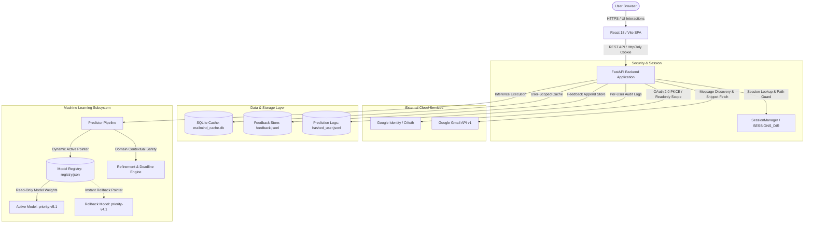
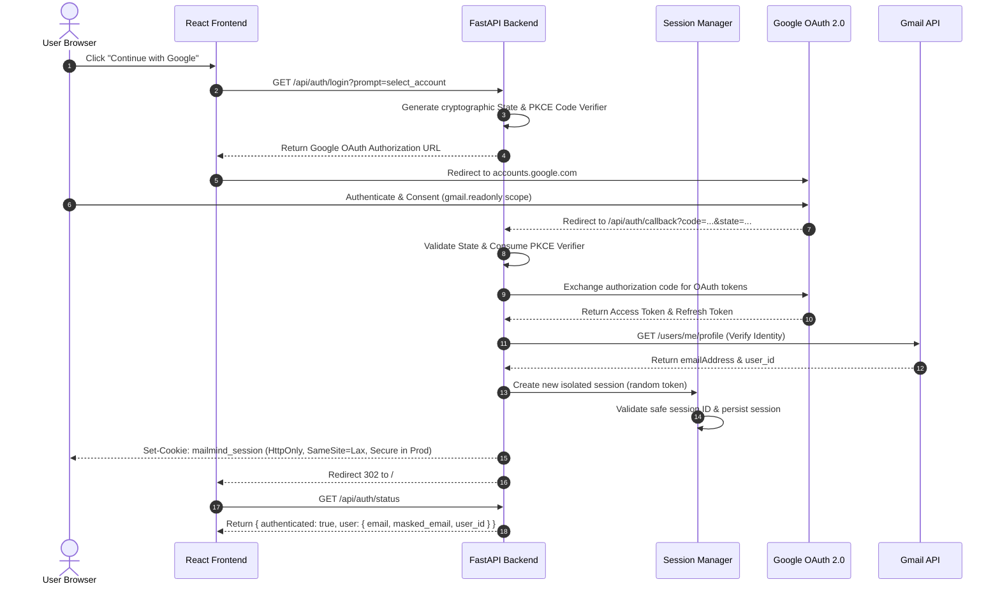
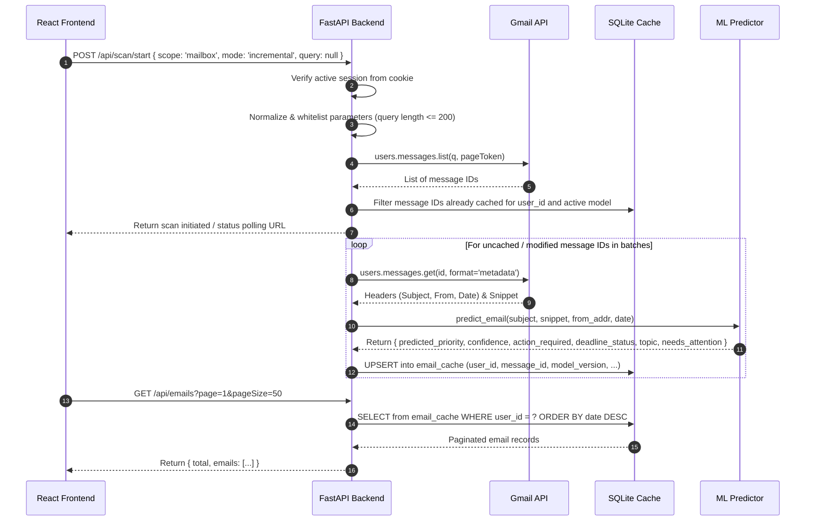
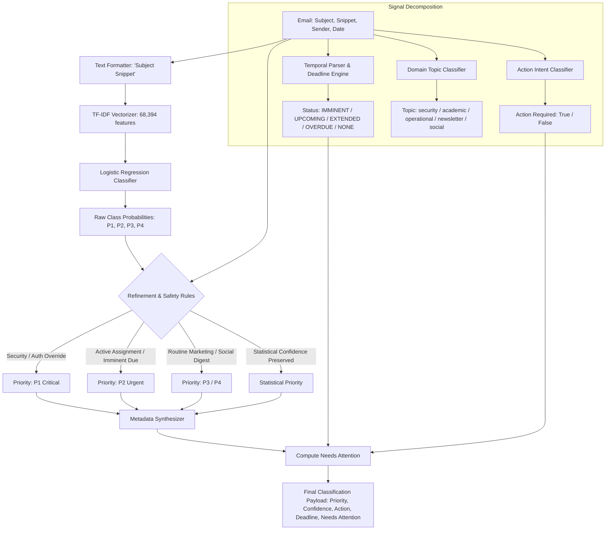
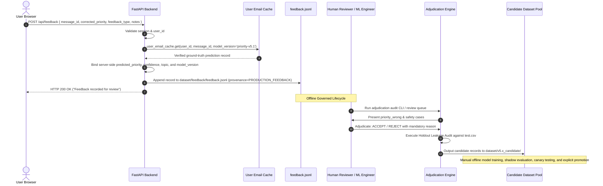
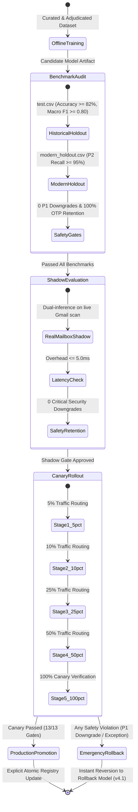
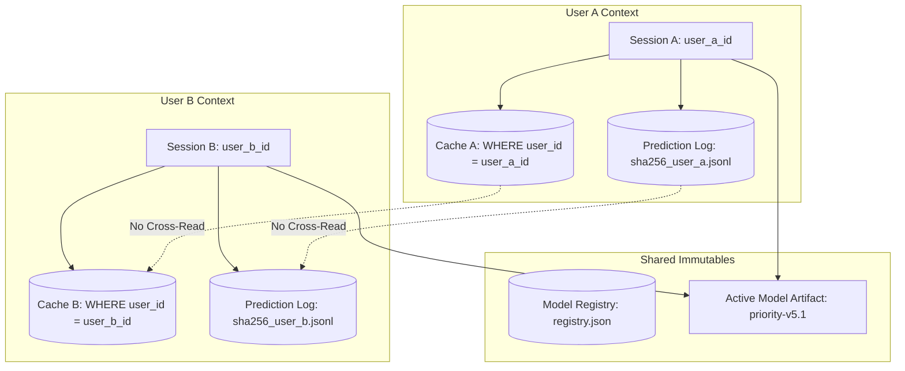
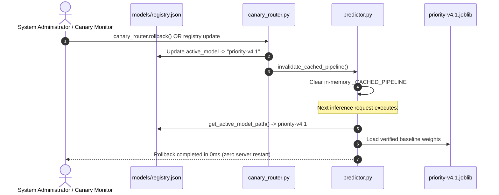

# MailMind System Architecture Specification

**System**: MailMind AI Email Priority Classification System  
**Version**: `v5.4.1-verified-production`  
**Active Production Model**: `priority-v5.1` (SHA-256: `8524ad73965859ee022f1271caee0040928e7805ab7d32c49b2f26e994f98c06`)  
**Rollback Model Baseline**: `priority-v4.1` (SHA-256: `09fe269f19ad6afb38e71b56f8c6ee7a386e59605c62c892478400bc09d5cbd0`)  
**Target Environment**: Enterprise Google Workspace / Gmail Integration  

---

## 1. High-Level System Architecture

MailMind operates on a decoupled client-server architecture consisting of a modern React/Vite single-page application (SPA) and an asynchronous Python FastAPI service. The backend interfaces with the official Google Gmail REST API via user-delegated OAuth 2.0 credentials and executes on-device inference using scikit-learn machine learning pipelines hardened with domain refinement rules.



---

## 2. Authentication Flow

Authentication is executed via Google OAuth 2.0 with Proof Key for Code Exchange (PKCE) and state protection.



### Security Properties
- **Zero Client-Side Credentials**: OAuth client secrets, access tokens, and refresh tokens are stored exclusively in backend sessions and are never transmitted to the frontend.
- **Session Hardening**: Session IDs are constrained to `^[A-Za-z0-9_\-~]{16,128}$` and strictly validated against path traversal (`_is_safe_session_id`).
- **Cookie Flags**: In production (`ENVIRONMENT=production`), cookies enforce `Secure=True`, preventing transmission over unencrypted HTTP.

---

## 3. Gmail Ingestion & Mailbox Scan Flow

The scan pipeline discovers email headers and metadata without storing raw email bodies permanently on disk.



---

## 4. Prediction Flow & Refinement Pipeline

MailMind decouples raw statistical inference from domain-specific deterministic safety rules.



### Signal Separation Rationale
- **Priority (P1–P4)**: Represents intrinsic email importance and processing urgency.
- **Action Required (Boolean)**: Completely orthogonal to priority. For example, a low-priority routine survey (P3) may require user action, while an urgent high-priority server alert (P1) is purely informational.
- **Deadline Detection**: Identifies concrete temporal commitments, comparing due dates against message timestamp and current wall-clock time.
- **Needs Attention**: Evaluated as `(priority in ['P1', 'P2']) or action_required or (deadline_status in ['IMMINENT', 'OVERDUE'])`.

---

## 5. Feedback Governance & Human Adjudication Flow

Production feedback is strictly separated from model training. **Under no circumstances does user feedback trigger automatic model retraining or parameter fitting.**



---

## 6. Model Lifecycle & Promotion Gates

Every ML model must progress through eight formal, non-bypassable promotion gates before production activation.



---

## 7. Multi-User Isolation Architecture

MailMind isolates users at every logical and physical boundary:



1. **Session Isolation**: Each user receives an independent cryptographic session ID bound to their unique Google account `user_id` and `email`.
2. **Cache Isolation**: The SQLite `email_cache` table uses a composite primary key `(user_id, message_id, model_version)`. Every query enforces `WHERE user_id = :user_id`.
3. **Feedback Isolation**: User feedback queries filter by `session.user_id`. Users cannot view or tamper with other users' feedback.
4. **Log Pseudonymization**: Prediction audit logs are written to per-user JSONL files named after a SHA-256 hash prefix of the user's ID (`predictions_<sha256[:16]>.jsonl`), preventing user enumeration.

---

## 8. Cache Architecture

The SQLite cache (`backend/mailmind_cache.db`) stores scan results to optimize latency and minimize Gmail API quota usage:

```sql
CREATE TABLE IF NOT EXISTS email_cache (
    user_id TEXT NOT NULL,
    message_id TEXT NOT NULL,
    model_version TEXT NOT NULL,
    thread_id TEXT,
    subject TEXT,
    from_address TEXT,
    date TEXT,
    snippet TEXT,
    predicted_priority TEXT,
    final_priority TEXT,
    confidence REAL,
    action_required INTEGER,
    deadline_detected INTEGER,
    deadline_date TEXT,
    deadline_status TEXT,
    topic TEXT,
    needs_attention INTEGER,
    first_seen_timestamp TEXT,
    last_updated_timestamp TEXT,
    PRIMARY KEY (user_id, message_id, model_version)
);
```

- **Composite Key**: `(user_id, message_id, model_version)` allows side-by-side coexistence of predictions across model version evaluations without collision or cache eviction.
- **No Raw Body**: Only message headers, snippets, and inference metadata are stored. Raw email message bodies are never written to the SQLite cache.

---

## 9. Rollback Architecture

MailMind incorporates an instantaneous, non-destructive rollback mechanism.



- **Rollback Target**: `priority-v4.1` (SHA-256: `09fe269f19ad6afb38e71b56f8c6ee7a386e59605c62c892478400bc09d5cbd0`).
- **Rollback Verification**: Instantaneous, zero-downtime transition without server reboots, cache deletions, or session resets.

---

## 10. Security Boundaries & Component Mutability

| Component | Mutability Classification | Security Boundary & Protections |
| :--- | :--- | :--- |
| **USER DATA** | **Transient / Ephemeral** | Raw email body and attachments are processed strictly in RAM during classification. Never written to disk or logs. |
| **MODEL ARTIFACT** | **IMMUTABLE (FROZEN)** | `priority-v5.1` and `priority-v4.1` are binary-locked and hash-verified before and after test execution. |
| **MODEL REGISTRY** | **Controlled / Versioned** | `dataset/models/registry.json` updated only via explicit, audited administrative promotions. |
| **FEEDBACK** | **Append-Only Store** | `dataset/feedback/feedback.jsonl` stores user-submitted corrections with cryptographic provenance. |
| **CACHE** | **Persistent Scoped Store** | `mailmind_cache.db` partitioned strictly by `user_id`. Stores only snippets and inference metadata. |
| **SESSION** | **Ephemeral Server State** | `SESSIONS_DIR` files protected by regex validation, realpath normalization, and commonpath enforcement. |
| **GMAIL API** | **External Boundary** | Communicates exclusively over TLS using OAuth 2.0 with minimal `https://www.googleapis.com/auth/gmail.readonly` scope. |
