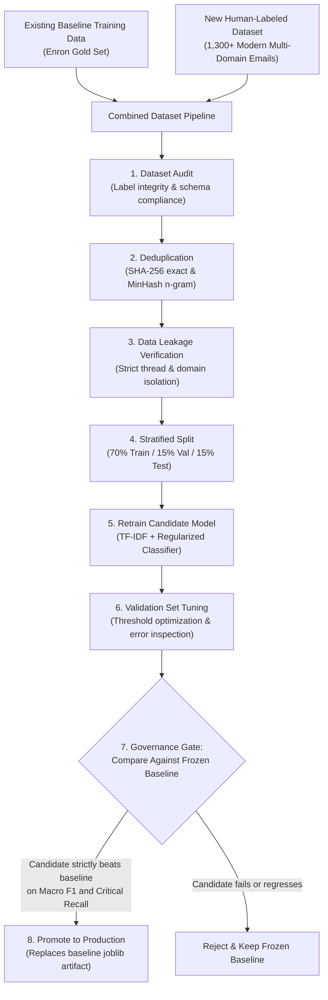

# CSE472: Data-Driven Model Improvement Plan & Retraining Architecture

This document formalizes the error analysis, data collection requirements, and future retraining methodology for the AI Email Priority system (MailMind).

---

## 1. Executive Summary: Why Blind Retraining is Defective

The Priority Refinement Layer successfully prevents critical user-facing misclassifications (such as Google OAuth alerts or NPTEL assignment solutions) by evaluating:
$$\text{Priority} = \text{Urgency} + \text{Required Action} + \text{Operational Consequence}$$

However, the refinement layer operates as a **post-inference operational rule system**. The underlying frozen TF-IDF + Logistic Regression model has not learned these patterns natively.

### Core Architectural Finding
- Adding infinite heuristic keyword rules is fragile and unsustainable.
- Conversely, **prematurely retraining the production model on a handful of mailbox examples is statistically irresponsible**.
- Training a 50,000+ parameter vocabulary model on 18 observed error instances would cause severe overfitting, high variance, and catastrophic forgetting of the general language representations established in the baseline.

**Verdict:** The production baseline model (`dataset/models/tfidf_logistic_baseline.joblib`) remains **STRICTLY FROZEN**. Future retraining must follow a rigorous, audit-controlled data collection and validation protocol.

---

## 2. Empirical Error Analysis of Live Mailbox Ingestion

From our systematic error audit across 100 live Gmail messages (`dataset/analysis/refinement_error_analysis.csv`), the distribution of final priorities was:
- **P4 (Low / Promotional / Routine):** 76 emails (76%)
- **P3 (Informational):** 1 email (1%)
- **P2 (Important):** 23 emails (23%)
- **P1 (Critical):** 0 emails (0%)

Only **2 emails (2%)** required priority refinement:
1. **Google Security Alert:** Refined from **P4 $\to$ P2** (Security verification: user authorization or account activity review required).
2. **NPTEL DL for NLP Assignment Solution:** Refined from **P4 $\to$ P3** (Academic informational update: solution released, no homework submission pending).

The remaining 22 P2 emails were natively predicted by the frozen baseline logistic regression model.

### Key Audit Findings & Failure Mechanisms
1. **Mailing List Footer Domination:** The word `unsubscribe` in academic and transactional emails exerts an outsized negative weight in the historical Enron model, penalizing legitimate notices.
2. **Modern OAuth Semantic Void:** 1999–2002 corporate Enron emails contained zero third-party OAuth access authorizations or two-factor authentication alerts.
3. **Keyword-Only Conflation:** The system must not treat "security" or "assignment" as monolithic words. A security newsletter is P4, while an unauthorized access alert is P1/P2. A solution release is P3, while an assignment deadline is P2.

---

## 3. Decoupling Priority, Action Required, and Topic

Prior iterations conflated priority, required action, and domain. Specifically, an earlier heuristic automatically assigned `action_required = True` to any email classified as P1 or P2 (`return final_priority in ["P1", "P2"]`).

### The Flaw of Coupling Priority and Action
Our live audit revealed that **20 out of 23 P2 emails** in the inbox had zero actionable requirements. They were important contextual communications:
- DoraHacks and ZebPay Terms of Use updates
- ByteByteGo technical essays
- Quora career digests
- Naukri event announcements

Marking these as "Action Required" inflated the count from 7 to 29, drowning the user in false urgency and defeating MailMind's core promise to save time.

### The Decoupled Architecture
The system now treats priority, action required, and domain as independent dimensions:

```
┌────────────────────────────────────────────────────────┐
│                      EMAIL MESSAGE                     │
└────────────────────────────────────────────────────────┘
          │                   │                  │
          ▼                   ▼                  ▼
┌──────────────────┐ ┌─────────────────┐ ┌───────────────┐
│     PRIORITY     │ │ ACTION REQUIRED │ │     TOPIC     │
│   (P1,P2,P3,P4)  │ │  (True / False) │ │   (Semantic)  │
└──────────────────┘ └─────────────────┘ └───────────────┘
```

1. **Priority (P1–P4):** Evaluates importance, consequence, and sender context.
   - **P1 (Critical / Urgent):** Active security breach, immediate account lockout, overdue payment causing service termination.
   - **P2 (Important):** Account notices, device authorizations, terms changes, bills, academic deadlines.
   - **P3 (Informational):** Solutions released, grades published, payment receipts, shipping notices.
   - **P4 (Low / Noise):** Marketing discounts, deals, weekly digests, sales newsletters.
2. **Action Required (`true` / `false`):**
   - Strictly evaluated based on behavioral action imperatives (e.g. `submit before`, `verify your account`, `confirm your email`, `services will be deleted/suspended`).
   - Non-action statements (`payment received`, `solution released`, `FYI`) explicitly suppress action flags.
3. **Needs Attention Synthesis:**
   Rather than treating all P2 emails as urgent tasks, "Needs Attention" is defined mathematically:
   $$\text{Needs Attention} = P_1 \lor (P_2 \land \text{action\_required}) \lor (\text{action\_required} \land \text{genuine\_deadline})$$

### Empirical Results on 100 Live Emails
| Category / Filter | Prior Coupled Count | Audited & Decoupled Count | Real In-Box Experience |
|:---|:---:|:---:|:---|
| **Needs Attention** | 29 | **4** | Clean focus on 4 actual tasks (Google alert, Neon deletion, Supabase pause, Kaggle deadline). |
| **Action Required** | 29 | **7** | Only emails with explicit recipient imperatives. |
| **Important** | 23 (conflated) | **23** | Strictly reflects all P2 emails for broad context. |
| **Deadline Signals** | 24 (loose regex) | **3** | Fixed: eliminated false matches on conversational words like "today". |


---

## 4. Required Labeled Dataset for Future Retraining

To teach the model genuine contextual distinctions rather than keyword heuristics, the future training set must collect balanced, human-annotated examples across all fine-grained subcategories:

### A. Security Domain (Target: 300+ balanced samples)
- **P1 Critical:** Active account compromise, unauthorized password change, account suspension/lockout, unauthorized login from unknown IP.
- **P2 Actionable:** New device authorization, 3rd party OAuth permission granted, one-time verification code (OTP), identity check.
- **P3 Informational:** Privacy policy changes, routine terms of service updates, monthly security checkup summary.
- **P4 Promotional:** Antivirus software sales, VPN discounts, cybersecurity webinars, marketing newsletters.

### B. Academic & Educational Domain (Target: 300+ balanced samples)
- **P2 Actionable:** Assignment released with explicit deadline, quiz closing notice, exam submission portal open, project due date.
- **P3 Informational:** Assignment solution released, answer keys published, exam grades/marks announced, lecture notes uploaded.
- **P4 Promotional:** Catalog course discounts, degree promotional emails, enrollment advertisements, webinar invites.

### C. Operational & Transactional Domain (Target: 300+ balanced samples)
- **P1 Critical:** Server outage alert, critical payment overdue notice, pending service suspension.
- **P2 Actionable:** Electricity/credit card bill due, renewal reminder, required action on support ticket.
- **P3 Informational:** Payment receipt, order confirmation, ticket booking confirmation, delivery tracking update.

### D. Commercial & Promotional Domain (Target: 400+ balanced samples)
- **P4 Noise:** E-commerce sales, food delivery cashback, airline flash deals, newsletters, recruitment digests.

---

## 5. End-to-End Future Retraining & Evaluation Workflow

When sufficient labeled data is gathered, the candidate model must follow this exact scientific protocol before any consideration of replacing the frozen baseline:



### Strict Governance Benchmark
The candidate model must be evaluated against the **frozen production baseline** on the frozen held-out test set (`dataset/processed/test.csv`, $N=300$):

| Metric | Frozen Baseline Threshold | Requirement for Candidate Model |
|:---|:---:|:---|
| **Test Accuracy** | `80.67%` | Must match or exceed (`>= 80.67%`) |
| **Macro F1 Score** | `0.7943` | Must strictly exceed (`>= 0.8100`) |
| **Weighted F1 Score** | `0.8005` | Must match or exceed (`>= 0.8005`) |
| **Critical Class Recall (P1 & P2)** | High precision | Zero degradation on critical urgency classes |

If the candidate model fails any threshold, the production model remains frozen, and the secondary refinement layer continues to handle operational edge cases safely.

---

## 6. Core Product Principle: MailMind's True Purpose

The ultimate objective of MailMind is:
> **"REDUCE THE TIME REQUIRED TO CHECK EMAIL."**

The goal is **NOT** theoretical 100% academic classification accuracy. The product value consists of:
1. **Surfacing Actionable Attention:** Immediately drawing user focus to genuine P1 and P2 emails that require decisions or submissions.
2. **Suppressing Obvious Noise:** Keeping promotional deals and newsletters at P4 without human triage fatigue.
3. **Model Explainability:** Explaining *why* an email was categorized (grounded feature terms and operational reasons).
4. **Frictionless Action:** Allowing the user to view the email payload and act immediately.
